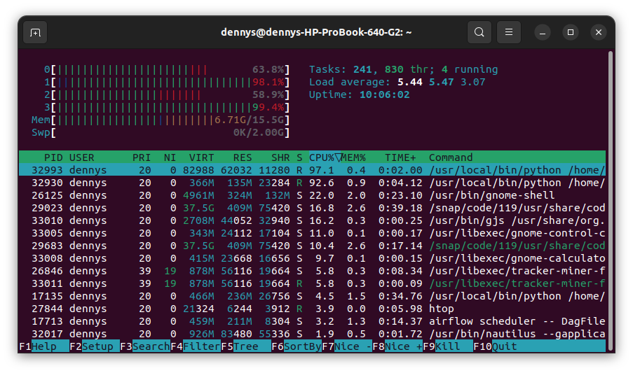

# Fundamentos de Airflow

## :wave: Bienvenid@s

En este curso exploraremos el rol de Airflow en el ecosistema de datos. Revisaremos algunos casos de uso y sus posibles soluciones.

Al finalizar el módulo podrás crear flujos de datos basados en código para ingestar, procesar y cargar información de manera robusta y escalable.

## :dart: Objetivo

El objetivo de este es curso es proporcionar las bases solidas al estudiante para poder crear sus propias soluciones de datos utilizando Airflow.

## :gear: Requerimientos

### Habilidades

- Buena experiencia usando Python (~ 1 año)
- Familiarizado con conceptos básicos como f-string, comprehensions, args/kwargs, etc.
- Familiarizado con los conocimientos básicos de la terminal de Linux
- Conocimiento básico trabajando con bases de datos (SQL incluido) y diferentes formatos de datos: CSV, JSON, etc.

### Hardware

Recomiendo ampliamente el uso de un equipo con 12-16 GB de RAM, ya que ejecutaremos seis contenedores simultáneamente para correr Airflow con Docker Desktop.

Esta es la salida del comando `htop` mientras se están ejecutando los seis contenedores, se observa que se consumen 6.71 de RAM yse utilizande forma intensiva dos de los cuatro núcleos disponibles.

### Software

- Cuenta de Github
- Docker Compose
- Visual Studio Code
  - [paquete de extension para Python](https://marketplace.visualstudio.com/items?itemName=ms-python.python)
  - [paquete de extension para Docker](https://marketplace.visualstudio.com/items?itemName=ms-azuretools.vscode-docker)
- Python 3.7/3.10

## 💻 Proyecto

A lo largo de las sesiones realizaremos diferentes pipelines que conformarán al final del curso un portafolio de pipelines.

## :bookmark_tabs: Sesiones

##### Describir el temario del módulo **Obligatorio** . (Borrar está linea una vez se hay leido) 

- [`Sesión 01:` Introducción a Apache Airflow](./Sesion-01)
- [`Sesión 02:` Conceptos básicos DAG, operadores y configuraciones](./Sesion-02)
- [`Sesión 03:` Pipeline en Airflow](./Sesion-03)
- [`Sesión 04:` Mejora de DAGs](./Sesion-04)
- [`Sesión 05:` DAGs avanzados](./Sesion-05)
- [`Sesión 06:` Entorno para producción](./Sesion-06)
- [`Sesión 07:` Plugins en Airflow](./Sesion-07)
- [`Sesión 08:` Seguridad](./Sesion-08)
