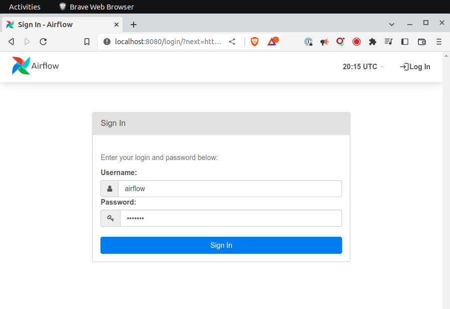

# Ejecución de Airflow con contenedores

## Requerimientos de sistema

Estos son los requisitos de sistema disponibles en la página de Docker Desktop.

### Mac

Su Mac debe cumplir con los siguientes requisitos para instalar Docker Desktop correctamente.

[Instalar Docker Desktop en Mac](https://docs-docker-com.translate.goog/desktop/install/mac-install/5_x_tr_sl=en&_x_tr_tl=es&_x_tr_hl=es-419&_x_tr_pto=wapp)

- macOS debe ser la versión 11 o posterior. Eso es Big Sur (11), Monterey (12) o Ventura (13). Recomendamos actualizar a la última versión de macOS.
- Al menos 4 GB de RAM.

### Linux

Para instalar Docker Desktop correctamente, su host Linux debe cumplir con los siguientes requisitos generales:

- Soporte de kernel y CPU de 64 bits para virtualización.
- Soporte de virtualización KVM.
- QEMU debe tener la versión 5.2 o posterior
- sistema de inicio systemd.
- Entorno de escritorio Gnome, KDE o MATE.
- Al menos 4 GB de RAM.
- Habilite la configuración de la asignación de ID en espacios de nombres de usuario, consulte Uso compartido de archivos .

[Instalar Docker Desktop en Linux](https://docs-docker-com.translate.goog/desktop/install/linux-install/5_x_tr_sl=en&_x_tr_tl=es&_x_tr_hl=es-419&_x_tr_pto=wapp#system-requirements)

### Windows

Tu equipo Windows deberá cumplir los siguientes requerimietos para instalar Docker Desktop.

#### Servidor WSL 2

- Windows 11 de 64 bits: Home o Pro versión 21H2 o superior, o Enterprise o Education versión 21H2 o superior.
- Windows 10 de 64 bits: Home o Pro 21H1 (compilación 19043) o superior, o Enterprise o Education 20H2 (compilación 19042) o superior.
- Habilite la función WSL 2 en Windows. Para obtener instrucciones detalladas, consulte la documentación de Microsoft .
- Se requieren los siguientes requisitos previos de hardware para ejecutar correctamente WSL 2 en Windows 10 o Windows 11:
    - Procesador de 64 bits con traducción de direcciones de segundo nivel (SLAT)
    - RAM del sistema de 4GB
    - El soporte de virtualización de hardware a nivel de BIOS debe estar habilitado en la configuración del BIOS. Para obtener más información, consulte Virtualización
- Descargue e instale el paquete de actualización del kernel de Linux .

[Instalar Docker Desktop en Windows](https://docs-docker-com.translate.goog/desktop/install/windows-install/5_x_tr_sl=en&_x_tr_tl=es&_x_tr_hl=es-419&_x_tr_pto=wapp)


Si tienes problemas con la instalación, aquí hay unos videos que pueden ayudarte

- [Install Docker on Windows 10](https://www.youtube.com/watch?v=lIkxbE_We1I&ab_channel=JamesStormes)
- [Install Docker on Windows 10 with WSL 2](https://www.youtube.com/watch?v=h0Lwtcje-Jo&ab_channel=BeachcastsProgrammingVideos)
- [Install Docker on Windows 11](https://youtu.be/6k1CyA5zYgg?t=249)


## Objetivo

- Ejecutar Airflow de manera local
- Preparar el ambiente de desarrollo

Utilizaremos la última imagen de Docker oficial disponible en el [repositorio](https://hub.docker.com/r/apache/airflow) de Airflow.

Si no cuentas con Docker Desktop puedes seguir cualquiera de las siguientes guías de instalación dependiendo de tu Sistema Operativo:

- [osx](assets/osx.md)
- [ubuntu](assets/ubuntu.md)
- [windows](assets/windows.md)

## Desarrollo

>**💡 Nota para experto(a)**
>
> Para ejecutar Airflow a través de contenedores virtualizaods
> es necesario tener instalado Docker Desktop

### Parte I. Ejecutar Airflow

1. Abrir una terminal
2. Verificar que tenemos instalado Docker Desktop

    ```bash
    docker desktop --version
    ```

3. Crear una carpeta y cambiarse a esa ubicación para convertirla en el directorio de trabajo

    ```bash
    mkdir airflow && cd airflow
    ```

4. Descargar el archivo YAML con la definición de todos los servicios de Airflow:

    ```bash
    curl -LfO 'https://airflow.apache.org/docs/apache-airflow/2.5.1/docker-compose.yaml'
    ```

5. Crear las siguientes carpetas: `dags`, `logs` y `plugins`.

    ```bash
    mkdir -p ./dags ./logs ./plugins
    ```

6. Crear un archivo `.env` que contenga la variable de ambiente `AIRFLOW_UID`

    ```bash
    echo -e "AIRFLOW_UID=$(id -u)" > .env
    ```

7. Inicializar la base de datos (única ocasión)

    ```bash
    docker compose up airflow-init
    ```

8. Ejecutar airflow y sus componentes

    ```bash
    docker compose up
    ```

9. Abrir una segunda terminal y verificar que todos los contenedores aparezcan con el estado `healty`

    ```bash
    docker ps
    ```

    |NAMES                         |STATUS|
    |-|-|
    |airflow-airflow-triggerer-1   |Up 5 minutes (healthy)|
    |airflow-airflow-webserver-1   |Up 5 minutes (healthy)|
    |airflow-airflow-worker-1      |Up 5 minutes (healthy)|
    |airflow-airflow-scheduler-1   |Up 5 minutes (healthy)|
    |airflow-postgres-1            |Up 5 minutes (healthy)|
    |airflow-redis-1               |Up 5 minutes (healthy)|


    > Si alguno de los contenedores no tiene el estado `healty`, puedes revisar los logs con `docker logs airflow-<nombre-del-contenedor>`.
    > Trata de encontrar el error y corregirlo, reiniciar Airflow con `docker-compose down` y luego `docker-compose up` y espera a que
    > todos los contenedores tengan el estado `healthy`


10. Abrir un navegador web usando la siguiente dirección [http://localhost:8080](http://localhost:8080)
11. Usar airflow como usuario y password en la página de inicio de sesión



### Parte II. Preparar el ambiente de desarrollo

1. Instalar [Visual Studio Code](https://code.visualstudio.com/download) (VS Code)
2. Instalar [paquete de extension para Python](https://marketplace.visualstudio.com/items5itemName=ms-python.python)
3. Instalar modulo de airflow, de preferencia en una ambiente virtual con Python 3.10

    ```bash
    pip install "apache-airflow[celery]==2.5.1" \
        --constraint "https://raw.githubusercontent.com/apache/airflow/constraints-2.5.1/constraints-3.7.txt"
    ```


## Recursos

- [Guía oficial](https://airflow.apache.org/docs/apache-airflow/stable/howto/docker-compose/index.html) de la installación de la versión 2.5.1
