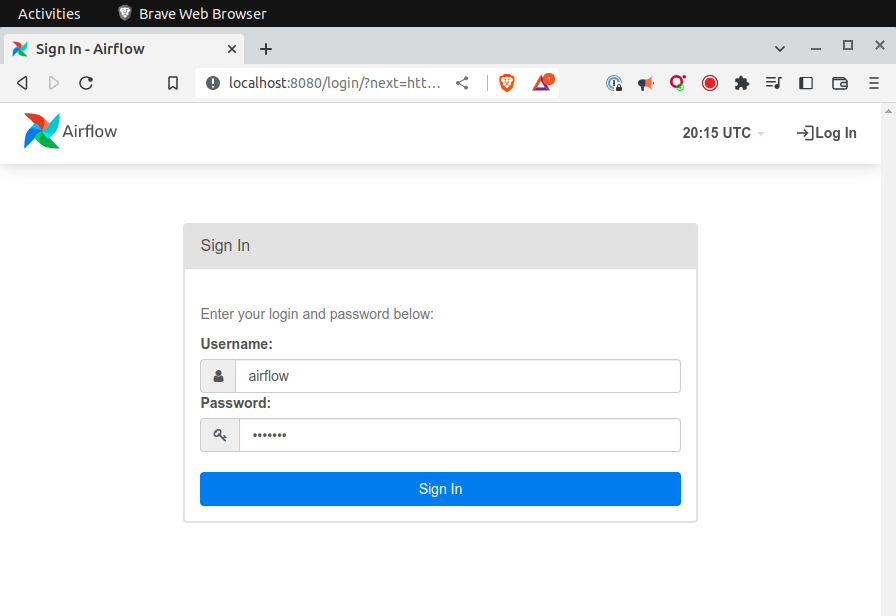

# Ejecutar Airflow de forma local

Utilizaremos la última imagen de Docker oficial disponible en el [repositorio](https://hub.docker.com/r/apache/airflow) de Airflow.

## Parte I. Instalación de Docker Compose

### Ubuntu 20.04 LTS (No Probado)

Aquí hay un tutorial para instalar Docker Compose con Brew en Ubuntu 22.04 LTS, incluyendo los pasos para instalar Brew:

1. Abre un terminal en tu sistema Ubuntu.
2. Ejecuta el siguiente comando para instalar Brew:

    ```bash
    sh -c "$(curl -fsSL https://raw.githubusercontent.com/Homebrew/install/master/install.sh)"
    ```

3. Agrega el repositorio de Brew a tu PATH con el siguiente comando:

    ```bash
    echo 'export PATH="/home/linuxbrew/.linuxbrew/bin:$PATH"' >>~/.bashrc
    ```

4. Actualiza la sesión actual de tu terminal con el siguiente comando:

    ```bash
    source ~/.bashrc
    ```

5. Verifica la instalación de Brew con el siguiente comando:

    ```bash
    brew doctor
    ```

6. Ejecuta el siguiente comando para asegurarte de tener una versión reciente de Brew:

    ```bash
    brew update
    ```

7. Instala Docker Compose con el siguiente comando:

    ```bash
    brew install docker-compose
    ```

8. Verifica la versión de Docker Compose instalada con el siguiente comando:

    ```bash
    docker-compose -v
    ```

9. Para asegurarte de que Docker Compose está funcionando correctamente, ejecuta el siguiente comando para crear un archivo de configuración de ejemplo:

    ```bash
    docker-compose config
    ```

10. Si se muestra una salida que contiene información sobre la configuración, entonces Docker Compose está funcionando correctamente en tu sistema Ubuntu.

### Mac OS (No Probado)

Utilizaremos el manejador de paquetes Homebrew para instalar Docker Compose.
Si ya tienes instalado Homebrew sigue los pasos de instalación de Docker Compose.

1. Abre la terminal en tu Mac y ejecuta el siguiente comando para instalar Homebrew:

    ```bash
    /bin/bash -c "$(curl -fsSL https://raw.githubusercontent.com/Homebrew/install/master/install.sh)"
    ```

2. Ejecuta el siguiente comando para asegurarte de que la instalación de Homebrew se haya completado correctamente:

    ```bash
    brew doctor
    ```

3. Para asegurarte de que la última versión de Homebrew esté instalada, ejecuta el siguiente comando:

    ```bash
    brew update
    ```

4. Verifica la instalación de Homebrew con el siguiente comando:

    ```bash
    brew -v
    ```

5. Abre la terminal en la Mac y ejecuta el siguiente comando para instalar Docker Compose:

    ```bash
    brew install docker-compose
    ```

6. Verifica la instalación de Docker Compose con el siguiente comando:

    ```bash
    docker-compose --version
    ```

7. Ejecuta el siguiente comando para verificar que Docker está instalado y funcionando correctamente:

    ```bash
    docker run hello-world
    ```

8. Si la instalación es correcta, verás un mensaje que indica que Docker se ha ejecutado correctamente y que está descargando una imagen de prueba.

### Windows 10 (No Probado)

De manera alternativa en Windows, se puede usar el WSL2 (Windows Subsystem for Linux 2) y seguir los pasos de instalación de Ubuntu.

1. Descarga e instala Docker Desktop para Windows en tu computadora desde el siguiente enlace: https://hub.docker.com/editions/community/docker-ce-desktop-windows/

2. Verifica que Docker Desktop esté ejecutándose correctamente en tu computadora.

3. Descarga la última versión de Docker Compose desde el siguiente enlace: https://github.com/docker/compose/releases

4. Descomprime el archivo ZIP de Docker Compose descargado en una ubicación accesible en tu computadora.

5. Abre una ventana de línea de comandos (cmd) como administrador en tu computadora.

6. Navega hasta la ubicación donde has descomprimido el archivo de Docker Compose en el paso 4.

7. Ejecuta el siguiente comando para copiar el archivo de Docker Compose en la ruta de acceso de tu computadora:

    ```cmd
    copy docker-compose.exe %ProgramFiles%\Docker\
    ```

8. Verifica la versión de Docker Compose instalada con el siguiente comando:

    ```cmd
    docker-compose -v
    ```

9. Para asegurarte de que Docker Compose está funcionando correctamente, crea un archivo de configuración de ejemplo con el siguiente comando:

    ```bash
    docker-compose config
    ```

10. Si se muestra una salida que contiene información sobre la configuración, entonces Docker Compose está funcionando correctamente en tu computadora Windows 10.

## Parte II. Ejecutamos Airflow




> La [guía oficial](https://airflow.apache.org/docs/apache-airflow/stable/howto/docker-compose/index.html) de la installación de la versión 2.5.1

1. Abrir una terminal
2. Creamos una carpeta `mkdir airflow && cd airflow` y nos cambiamos a esa ubicación para convertirlo en nuestro directorio de trabajo.
3. Descargamos el archivo YAML con la definición de todos los servicios de Airflow: `airflow-scheduler`, `airflow-webserver`, `airflow-worker`, `airflow-init`, `postgres` y `redis`.

    ```bash
    curl -LfO 'https://airflow.apache.org/docs/apache-airflow/2.5.1/docker-compose.yaml'
    ```

4. Crear las siguientes carpetas `dags`, `logs` y `plugins`.

    ```bash
    mkdir -p ./dags ./logs ./plugins
    ```

5. (Solo Linux) Crear un archivo `.env` que contenga la variable de ambiente  `AIRFLOW_UID`

    ```bash
    echo -e "AIRFLOW_UID=$(id -u)" > .env
    ```

6. Inicializar la base de datos

    ```bash
    docker compose up airflow-init
    ```

7. Ejectuar airflow

    ```bash
    docker compose up
    ```

8. En una segunda terminal ejecuta `docker ps` para verificar que los seis contenedores tengan el estado `(healthy)`

    ```bash
    CONTAINER ID   IMAGE                  COMMAND                  CREATED          STATUS                    PORTS                                       NAMES
    ad53fd953198   apache/airflow:2.5.1   "/usr/bin/dumb-init …"   17 minutes ago   Up 17 minutes (healthy)   8080/tcp                                    airflow-airflow-worker-1
    6475baada6c1   apache/airflow:2.5.1   "/usr/bin/dumb-init …"   17 minutes ago   Up 17 minutes (healthy)   8080/tcp                                    airflow-airflow-scheduler-1
    27c8b514668e   apache/airflow:2.5.1   "/usr/bin/dumb-init …"   17 minutes ago   Up 17 minutes (healthy)   0.0.0.0:8080->8080/tcp, :::8080->8080/tcp   airflow-airflow-webserver-1
    65fb3a1b0725   apache/airflow:2.5.1   "/usr/bin/dumb-init …"   17 minutes ago   Up 17 minutes (healthy)   8080/tcp                                    airflow-airflow-triggerer-1
    234e2ca33d24   postgres:13            "docker-entrypoint.s…"   20 minutes ago   Up 20 minutes (healthy)   5432/tcp                                    airflow-postgres-1
    cf1a9c674a2d   redis:latest           "docker-entrypoint.s…"   20 minutes ago   Up 20 minutes (healthy)   6379/tcp                                    airflow-redis-1
    ```

9. Abrir un navegador web usando la siguiente dirección [http://localhost:8080](http://localhost:8080)

10. Usar `airflow` como usuario y password en la página de login

## Visual Studio Code

1. Instalar el módulo de Airflow de manera local, de preferencia usando un ambiente virtual con Python 3.10

    ```bash
    pip install "apache-airflow[celery]==2.5.1" --constraint "https://raw.githubusercontent.com/apache/airflow/constraints-2.5.1/constraints-3.7.txt"
    ```

2. Instalar el plugin de Python en VSCode para habilitar la funcionalidad de autocompletado y detección de errores de sintaxis.
