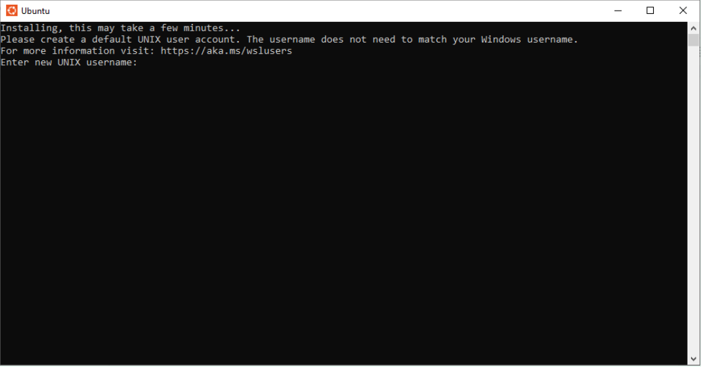
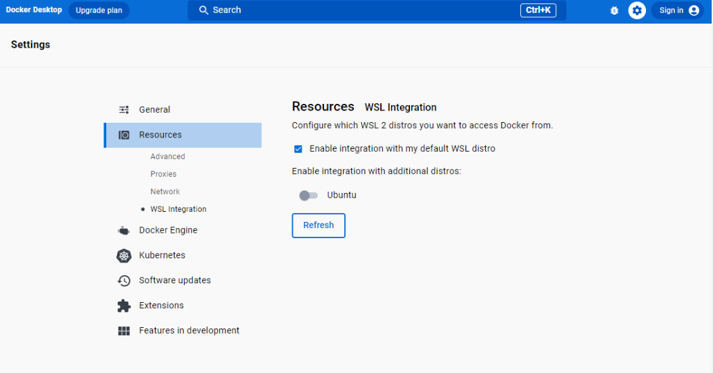
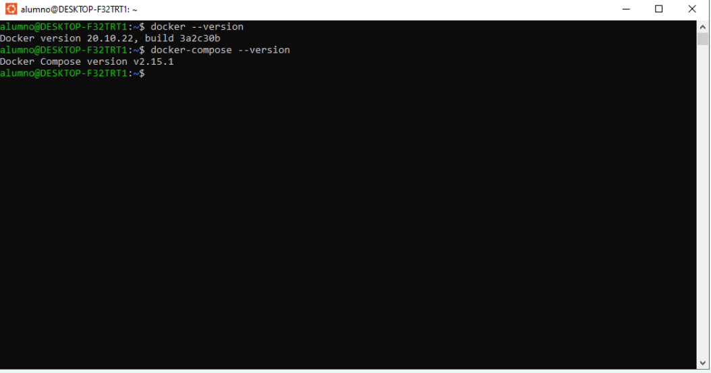
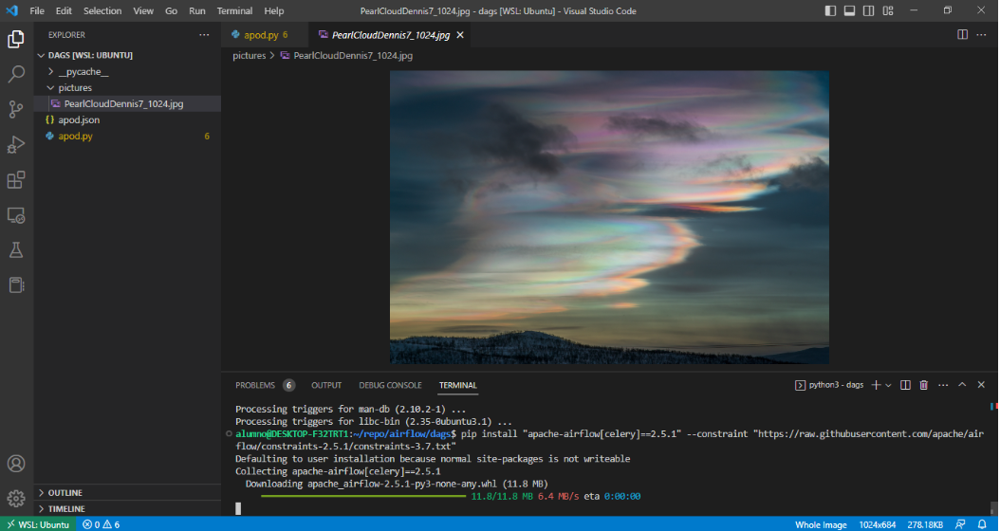

# Cómo instalar Docker en Windows

El proceso de instalación se divide en dos etapas, primero vamos a activar el subsistema de windows para Linux (WSL) y en posteriormente vamos a instalar y a probar Docker.

Este tutorial se probó en una HP 640 G2, con las siguientes características

- Operating System Windows 10 Pro
- Processor	Intel(R) Core(TM) i7-6600U CPU @ 2.60GHz   2.81 GHz
- Installed RAM	16.0 GB (15.9 GB usable)
- System type 64-bit operating system, x64-based processor

## Parte I. Activación del WSL

1. Haga clic en Inicio, escriba PowerShell, haga clic con el botón derecho en Windows PowerShell y, después, haga clic en Ejecutar como administrador
2. Ejecutar el comando `wsl --install`
3. Al terminar la instalación será necesario reiniciar el equipo
4. (Opcional) Abrir nuevamente PowerShell como administrador y revisar la versión del WSL usando el siguiente comando `wsl -l -v`

    ```bash
    NAME      STATE           VERSION
    * Ubuntu    Running         2
    ```

    > NOTA: Si cuentas con la versión 1 deberás seguir las instrucciones para actualizarla: [Actualización de la versión de WSL 1 a WSL2](https://learn.microsoft.com/es-mx/windows/wsl/install#upgrade-version-from-wsl-1-to-wsl-2)

5. Haga clic en Inicio, escriba Ubuntu y haga clic para abrir el subsistema de Linux con esta distribución

    

6. Ingresa un nombre de usuario y contraseña.
7. Actualiza los paquetes de ubuntu con el siguiente comando

    ```bash
    sudo apt update && sudo apt upgrade
    ```

### Resolución de problemas

#### Problemas relacionados con la virtualización

1. Abrir powershell con permisos de administrador
2. Ejecutar `Systeminfo.exe` e ir a la seccion `Hyper-V Requirements`,

    ```bash
    Hyper-V Requirements:
        VM Monitor Mode Extensions: Yes
        Virtualization Enabled In Firmware: No
        Second Level Address Translation: Yes
        Data Execution Prevention Available: Yes
    ```

    > En este caso en particular, el problema se resuelve habilitando la virtualización en el BIOS del sistema
3. Reiniciar el Sistema y entrar a las opciones del BIOS
4. Ir a `System Configuration` > `Device Configuration`, buscar cualquiera de las opciones `BIOS Virtualization` o `VT-X` y habilitarlo.

5. (Opcional) Ejecutar `Systeminfo.exe` para verificar el estado de los requerimientos de `Hyper-V`.

    ```bash
    Hyper-V Requirements:      A hypervisor has been detected. Features required for Hyper-V will not be displayed.
    ```

## Parte II. Instalación de Docker

1. [Descargar](https://desktop.docker.com/win/main/amd64/Docker%20Desktop%20Installer.exe) Docker Desktop
2. Ejecutar el instalador y seguir los pasos del asistente usando las opciones predefinidas de instalación
3. Una vez completada la instalación, habilitar la integración del WSL siguiendo los siguientes paso
    - Abrir la aplicación de Docker
    - Ir a Confgiguration > Resources > WSL Integration
    - Habilitar Ubuntu
    - Click en el botón `Apply & Restart` para que los cambios tengan efecto

    
4. Abrir la app de Ubuntu
5. Revisar la version de Docker y Docker Compose usando `docker --version` y `docker-compose --version` de manera correspondiente.
    


## Parte III. Preparar el ambiente de desarrollo

1. Instalar [Visual Studio Code](https://code.visualstudio.com/download) (VS Code)
2. Instalar [paquete de extension de desarrollo remoto.
](https://marketplace.visualstudio.com/items?itemName=ms-vscode-remote.vscode-remote-extensionpack)
3. Abrir el palete de comandos de VS Code (Ctrl + Mayús + P), escriba: `Contenedores de desarrollo: Abrir carpeta en contenedor...` y seleccione **Ubuntu** .
4. Instalar [paquete de extension para Python](https://marketplace.visualstudio.com/items?itemName=ms-python.python)
5. Instalar modulo de airflow, de preferencia en una ambiente virtual con Python 3.10

    ```bash
    pip install "apache-airflow[celery]==2.5.1" --constraint "https://raw.githubusercontent.com/apache/airflow/constraints-2.5.1/constraints-3.7.txt"
    ```



## Recursos

- [Configuración de un entorno de desarrollo de WSL](https://learn.microsoft.com/es-mx/windows/wsl/setup/environment#set-up-your-linux-username-and-password)
- [Instalación de Docker Desktop](https://learn.microsoft.com/es-mx/windows/wsl/tutorials/wsl-containers#install-docker-desktop)
- [Empezar a usar Visual Studio Code con WSL](https://learn.microsoft.com/es-mx/windows/wsl/tutorials/wsl-vscode)
