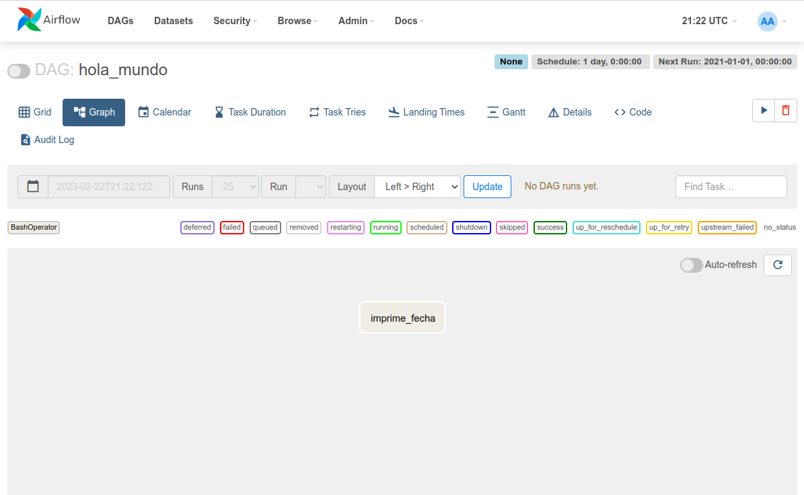

# Ejemplo 1 - Hola mundo

## Objetivo

- Conocer la estructura básica de un DAG a través de un ejemplo sencillo que imprime la fecha actual
- Utilizar VS Code para crear el archivo DAG `hola_mundo.py` y familiarizarse con el flujo de trabajo
- Activar y ejecutar un DAG
- Consultar los resultados de ejecución del DAG a través del log

## Desarrollo

1. Abrir VS Code
2. Abrir la carpeta `airflow` que creamos en el ejemplo anterior
3. Copiar el archivo [`Sesion-01/Ejemplo-02/assets/dags/hola_mundo.py`](assets/dags/hola_mundo.py) al directorio de trabajo dentro de la carpeta `dags`.
4. Ir a la interfaz de Airflow [localhost:8080](localhost:8080)
5. Seleccionar el dag `hola_mundo` de la lista
6. Activar el DAG
7. Disparar el DAG
8. Una vez terminada la ejecución, haz click sobre la tarea `imprime_fecha` y luego seleccion la opción `Log` para ver los resultados.