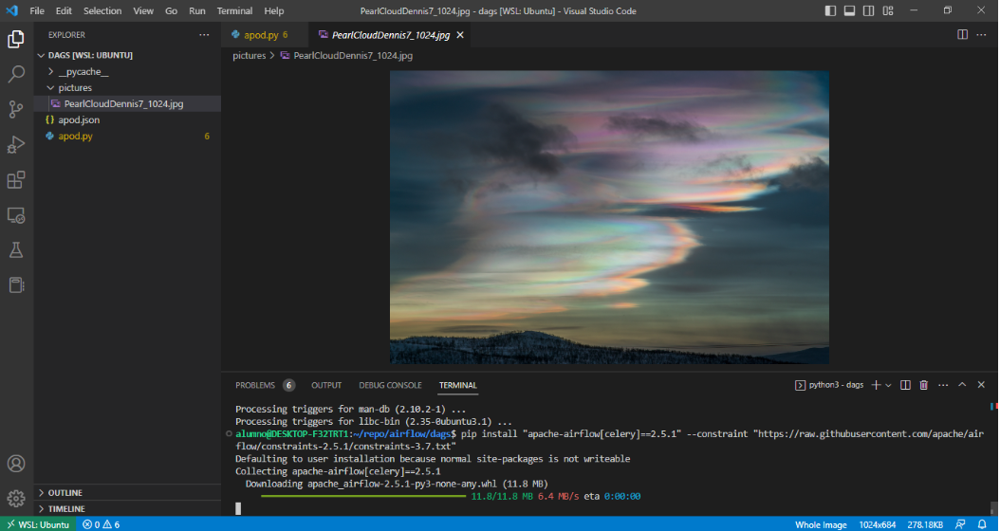

# Preparar el ambiente de desarrollo

1. Instalar [Visual Studio Code](https://code.visualstudio.com/download) (VS Code)
2. Abrir VS Code e instalar los siguientes paquetes
    - Instalar [paquete de extension para Python](https://marketplace.visualstudio.com/items5itemName=ms-python.python)
    - Instalar [paquete de extensión para Docker](https://code.visualstudio.com/docs/containers/overview)

3. Crear un carpeta `airflow`
4. Cambiarse de directorio `cd airflow`
5. Crear un ambiente virtual de Python 3.7+  `python -m venv myenv`
6. Activar el ambiente que acabas de crear `source myenv/bin/activate`

    ```bash
    (myenv) dennys@dennys-HP-ProBook-640-G2:~/airflow/$
    ```

7. Instalar modulo de airflow

    ```bash
    pip install "apache-airflow[celery]==2.5.1" \
        --constraint "https://raw.githubusercontent.com/apache/airflow/constraints-2.5.1/constraints-3.7.txt"
    ```



## Recursos

- [Guía oficial](https://airflow.apache.org/docs/apache-airflow/stable/howto/docker-compose/index.html) de la installación de la versión 2.5.1
