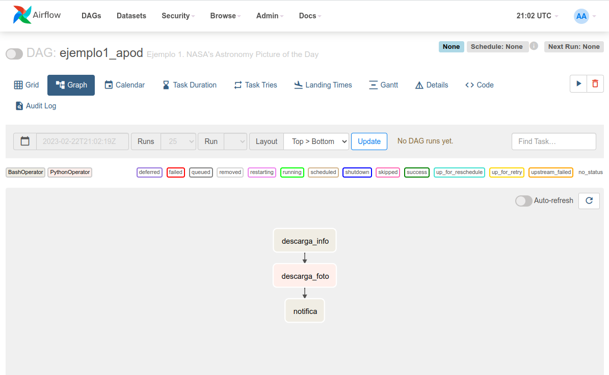

# Ejemplo 1 - Fotografía astronómica del día (APOD por sus siglas en inglés)

## Objetivo

 * Crear una tarea que que se conecte a una fuente externa usando un comando BASH
* Crear una tarea que descargué una imagen usando una función de Python
* Crear una tarea que contabilice el número de archivos que contiene un directorio

## Desarrollo

1. Abrir VS Code
2. Abrir la carpeta `airflow` que creamos en el ejemplo anterior
3. Copiar el archivo [`Sesion-02/Ejemplo-01/assets/dags/basic_apod.py`](assets/dags/basic_apod.py) al directorio de trabajo dentro de la carpeta `dags`.
4. Ir a la interfaz de Airflow e iniciar sesión airflow/airflow [http://localhost:8080](localhost:8080)
5. Seleccionar el dag `ejemplo1_apod`
6. Activar el DAG
7. Disparar el DAG de forma manual
8. Una vez terminada la ejecución podemos usar la vista de cuadrícula o de grafo, hacer click en cada una de las tareas y explorar los resultados del log.
9. En VS Code explorar el contenido de la carpeta `dags` y abrir el archivo `apod.json` y el archivo `.jpg`
