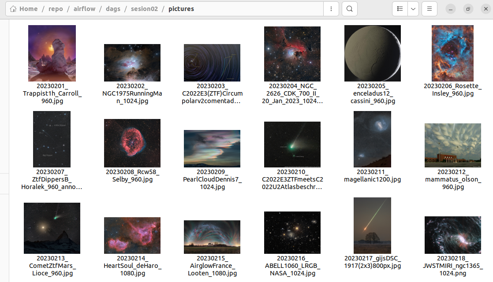
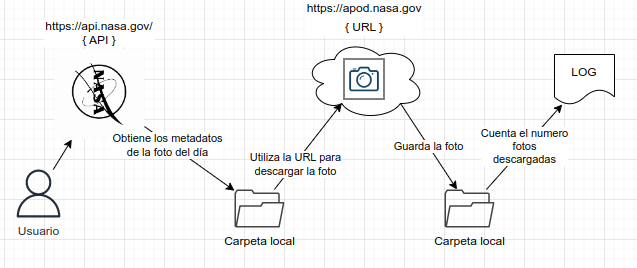
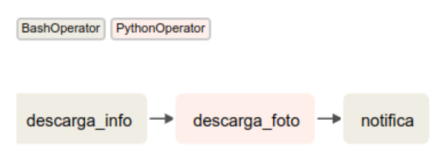

# Sesión 2: Conceptos Básicos 🤖

## 1. Objetivos

- Crear el primer archivo DAG en python y ejecutarlo
- Usar el operador BashOperator para ejecutar comandos BASH
- Usar el operador PythonOperator para llamar funciones Python
- Definir las dependencias entre tareas
- Monitorear la ejecución del DAG y revisar los resultados de las tareas

## 2. Contenido

Vamos a conectar cada uno de las temas de esta sesión en un sólo ejercicio a través de un caso de uso



### Caso de Uso: Salvapantallas con fotos de la NASA

Digamos que nos gustaría recopilar esas impresionantes fotografías del espacio que obtiene la NASA. Además de las fotografías también estamos interesados en obtener los metadatos de la misma: el título, la descripción, etc.

API: [https://api.nasa.gov/](https://api.nasa.gov/)



Lo primero que tenemos que hacer es desglosar el proceso en tareas, sabemos que debemos descargar la metadata, la fotografía y también vamos a agregar una última tarea para contabilizar el número de fotografías que hemos descargado hasta el momento.

Un posible flujo de tareas sería el siguiente:


> Airflow utiliza un código de colores para representar cada tipo de operador.

1. Descargar los metadatos a través de una API pública
2. Descargar la fotografía del día
3. Contabilizar el total de fotografías descargadas hasta el momento

Para definir este pipeline usaremos dos de los operadores que son parte del núcleo de Airflow: *BashOperator* y *PythonOperator*.

- [BashOperator](https://airflow.apache.org/docs/apache-airflow/stable/howto/operator/bash.html) se utiliza para ejecutar comandos de linux utilizando el intérprete BASH.
- [PythonOpeator](https://airflow.apache.org/docs/apache-airflow/stable/howto/operator/python.html). se usa para ejecutar llamadas de función de Python.

 Iremos implementando la solución de manera gradual, poniendo en práctica cada uno de los temas estudiados previamente. Nos apoyaremos de algunos retos a lo largo de la implemntación para reforzar el conocimiento adquirido.

### Preparación

1. Abrir una terminal
2. Cambiarse al directorio de trabajo de airflow, por ejemplo:

  ```bash
  cd ~/repo/airflow
  ```

3. Este directorio debe contener el archivo `docker-compose.yaml` y las tres carpetas que creamos en la sesión anterior: `dags`, `plugins` y `logs`


4. Dentro de VS Code, activamos la terminal **Ver > Terminal**
5. Activamos nuestro ambiente virtual con Python3.7 o Python3.10
6. Instalamos el módulo de apache airflow si no lo hemos instalado antes

  ```bash
  pip install "apache-airflow[celery]==2.5.1" \
          --constraint "https://raw.githubusercontent.com/apache/airflow/constraints-2.5.1/constraints-3.7.txt"
  ```

7. Abrimos la paleta de comandos **View > Command Palette...**, empezamos a escribir `Python: Select Interpreter` y seleccionamos el nombre de nuestro ambiente virtual de Python.

 > Esta paso garantiza que VS Code reconozca los módulos de airflow, muestre la ayuda y el autocompletado asumiendo que el [paquete de extension para Python](https://marketplace.visualstudio.com/items?itemName=ms-python.python) este instalado.

6. Levantamos los servicios de airflow
  
  ```bash
  docker-compose up
  ```

7. Verificamos que todos los servicios aparezcan con el estado `healthy`

```bash
docker ps
```

8. Abrimos un navegador con la dirección [http://localhost:8080](http://localhost:8080) y comprobamos que el servidor web funciona correctamente.

 ### Paso 1. Creación de un archivo DAG

1. Abrimos Visual Studio Code (VS Code)
2. Seleccionamos la opción del menú **File > Open Folder...**
3. Ubicamos nuestra carpeta de trabajo y seleccionamos. Se trata de la misma carpeta que contiene el archivo `docker-compose.yaml`
4. Abrimos el explorador de archivos y creamos un archivo dentro de la carpeta `dags` con el nombre `apod.py`

### Paso 2. Declaración del DAG

Sabemos que existen tres formas diferentes de declarar un dag, en esta ocasión usaremos el constructor

1. Lo primero que tenemos que hacer es importar el módulo de Airflow que contiene la clase DAG.

  ```python
  from airflow import DAG
  import pendulum
  ```

2. Después creamos un objeto DAG usando el constructor

  ```python
  dag = DAG( ①
    dag_id="ejemplo1_apod", ② 
    description="Ejemplo 1. NASA's Astronomy Picture of the Day",                    
    start_date=pendulum.datetime(2023, 1, 15, tz="UTC"),③   
    schedule=None ④        
  )
  ```

- ① Instancia del objeto DAG
- ② Nombre del DAG
- ③ Marca el inicio del primer intervalo del DAG
- ④ El intervalo de ejecuión que usará el Scheduler para planear las ejecuciones automáticas

3. Guardamos nuestro archivo DAG
4. Abrimos Airflow en el navegador y buscamos el dag con el nombre `ejemplo1_apod`

  > PROBLEMA: Aunque nuestro DAG no produce ningún error de sintaxis, no se mostrará en la interfaz hasta que tenga asociado al menos una tarea.

  > SOLUCIóN: Utilizaremos el operador EmptyOperator, que literalmente no realiza ninguna acción, comunmente se usa para agrupar otras tareas para resolver este inconveniente.

5. Importamos el operador `EmptyOperator`

```python
from airflow.operators.empty import EmptyOperator
```

6. Instanciamos el operador y lo asociamos a nuestro dag

```python
EmptyOperator(task_id='empty', dag=dag)
```
7. Si todo va bien, esta vez el DAG `ejemplo1_apod` aparecerá en la página principal de Airflow

8. Para verificar que tu DAG no contiene errores de sintaxis ni de dependencias, puedes ejecutar en la terminal:

  ```bash
  python tu-archivo-dag.py
  ```

[parte1_apod.py](Ejemplo-01/assets/dags/parte1_apod.py)

---
### Reto 1. Declara un DAG a través de un manejador de contexto

Cambia la forma en que se declara el DAG usandon un manejador de contexto en su lugar.

1. Crear un nuevo archivo DAG
2. Declara el DAG con un nuevo nombre, `dag_id`
3. Comprueba que no tienes errores de sintáxis
4. Activa y ejecuta el DAG

---

### Paso 3. Uso del operador `BashOperator`

Utilizaremos el operador `BashOperator` para hacer una petición a la API pública de la NASA. Como sabemos este operador nos permite ejecutar los comandos que normalmente ejecutamos en nuestra terminal.

Para interactuar con la API, utilizaremos el comando `curl` para hacer la solicitud GET y guardar la respuesta `JSON` en un archivo.

```bash
curl -o apod.json -L 'https://api.nasa.gov/planetary/apod?api_key=DEMO_KEY
```

> TIP: Recuerda que si necesitas consultar la documentación de cualquier comando puedes agregar el parámetro `--help`.

```bash
curl --help
Usage: curl [options...] <url>
 -d, --data <data>          HTTP POST data
 -f, --fail                 Fail silently (no output at all) on HTTP errors
 -h, --help <category>      Get help for commands
 -i, --include              Include protocol response headers in the output
 -o, --output <file>        Write to file instead of stdout
 -O, --remote-name          Write output to a file named as the remote file
 -s, --silent               Silent mode
 -T, --upload-file <file>   Transfer local FILE to destination
 -u, --user <user:password> Server user and password
 -A, --user-agent <name>    Send User-Agent <name> to server
 -v, --verbose              Make the operation more talkative
 -V, --version              Show version number and quit
```

Ejemplo del contenido del archivo `apod.json`

```json
{"copyright": "Petr HoralekInstitute of Physics in Opava",
 "date": "2023-02-07",
 "explanation":"Can you still see the comet? Yes.Even as C/2022 E3 (ZTF)",
 "hdurl": "https://apod.nasa.gov/apod/image/2302/ZtfDippersB_Horalek_960_annotated.jpg",
 "media_type": "image",
 "service_version": "v1",
 "title": "A Comet and Two Dippers",
 "url":"https://apod.nasa.gov/apod/image/2302/ZtfDippersB_Horalek_960_annotated.jpg"}
```

La respuesta incluye el título, la fecha y una breve explicación de la fotografía. También podemos encontrar dos ligas URL que hacen referencia la imagen en dos diferentes resoluciones.

Ahora regresemos a nuestro archivo DAG, antes de usar cualquier operador debemos importarlo.

1. Agregamos el módulos de Airflow que contienen la clase `BashOperator`.

  ```python
  from airflow.operators.bash import BashOperator
  ```

2. Para crear nuestra primera tarea, instanciamos de la clase `BashOperator`

  > En Airflow, la instancia de una clase operador se conoce como tarea.

```python
descarga_info = BashOperator(
  task_id="descarga_info", ①
  bash_command="curl -o galeria/metadata/apod.json -L 'https://api.nasa.gov/planetary/apod?api_key=DEMO_KEY'" ②  
)
```

1. El nombre de la tarea
2. El comando BASH

[parte2_apod.py](Ejemplo-01/assets/dags/parte2_apod.py)

---
### Reto 2. ¿Cuál es la foto que corresponde al día de tu cumpleaños?

La base de datos de APOD almacena todas la fotografías desde 1995, utiliza la [documentación disponible](https://api.nasa.gov/) para construir un comando bash que obtenga los datos de la fotografía que la NASA capturó el día de tu pasado cumpleaños.

1. Crear un nuevo archivo DAG
2. Declara el DAG con un nuevo nombre, `dag_id`
3. Agrega un BashOperator
4. Utiliza el comando `curl` correspondiente para descargar el archivo `JSON`
5. Comprueba que no tienes errores de sintáxis
6. Activa y ejecuta el DAG
7. Comprueba que el campo `date` dentro del arhivo `JSON` corresponde al día de tu último cumpleaños

> Sugerencia: Utiliza la terminal para probar tu comando `curl` antes de implementar el DAG
---

### Paso 3. Uso del operador `PythonOperator`

En este paso crearemos una función en Python para leer el archivo `JSON` con los metadatos, después extraemos la url de la imagen, y usamos `requests` para descargar la imagen y guardarla en un archivo local.

1. Importamos las dependencias usadas por nuestra función

```python
import logging
import json
import pathlib
import requests
import requests.exceptions as requests_exceptions
```

2. Agregamos la definición de la función `_descarga_foto`

  ```python
  def _descarga_foto():
      # creamos la carpeta destino si no existe
      OUTPUT_DIR = '/opt/airflow/dags/sesion02/pictures'
      INPUT_DIR = '/opt/airflow/dags/sesion02/metadata'
      pathlib.Path(OUTPUT_DIR).mkdir(parents=True, exist_ok=True)
      # recuperamos los metadatos descargados en el paso anterior
      with open(f'{INPUT_DIR}/apod.json', 'r') as f:
          info = json.load(f)
          image_url = info['url']        
          try:
              image_filename = image_url.split("/")[-1]
              target_file = f'{OUTPUT_DIR}/{image_filename}'
              logging.info(f"Descargando la foto del día {image_url} al archivo local: {target_file}")

              response = requests.get(image_url, timeout=100)
              with open(target_file, "wb") as f:
                  f.write(response.content)            
          except requests_exceptions.ConnectionError:
              logging.error(f"Error de conexión {image_url}.")
      return info['title']
  ```

3. Importamos la clase `PythonOperator`

  ```python
  from airflow.operators.python import PythonOperator
  ```

4. Ahora creamos una instancia del operador `PythonOperator` y usamos la propiedad `python_callable` para hacer referencia al nombre de la función que queremos ejecutar, en este caso nuestra función `_descarga_foto`

  ```python
  descarga_foto = PythonOperator(
    task_id="descarga_foto",
    python_callable=_descarga_foto
  )
  ```

[parte3_apod.py](Ejemplo-01/assets/dags/parte3_apod.py)

### Paso 4. Usamos `BashOperator` para saber cuántas fotos tenemos en nuestra galería

Esta vez usaremos dos comandos encadenados, `ls` para listar el contenido del directorio y `wc -l` para contar el número de lineas de la salida de `ls`.


```python
OUTPUT_DIR = '/opt/airflow/dags/sesion02/pictures'
notifica = BashOperator(
   task_id="notifica",
 bash_command=f'echo "Ahora son $(ls {OUTPUT_DIR} | wc -l) fotografías."'
)
```

[parte4_apod.py](Ejemplo-01/assets/dags/parte4_apod.py)

### Paso 5. Definición de dependencias

Por último definimos las dependencia entre tareas utilizando el operador de desplazamiento de bit

```python
descarga_info >> descarga_foto >> notifica
```

---
### Reto 3. Definición de dependencias y calendarización

Reescribir la dependencia entre tareas y programa el DAG para que se ejecute diariamente a las 7 am CST.

1. Utiliza el archivo dag [basic_apod.py](Ejemplo-01/assets/dags/basic_apod.py)
2. Comenta la línea que define las dependencias
3. Define las dependencias utilizando cualquiera de las siguientes funciones: `chain`, `set_upstream` o `set_downstream`
4. Verifica que la visualización del grafo siga siendo la misma después de tus cambios
5. Modifica los parámetros del DAG y utiliza [crontab guru](https://crontab.guru/) para definir la expresión cron.

---


### 3. Postwork

Encuentra las indicaciones y consejos para reflejar los avances de tu proyecto de este módulo.

- [**`POSTWORK SESIÓN 1`**](./Postwork/)
