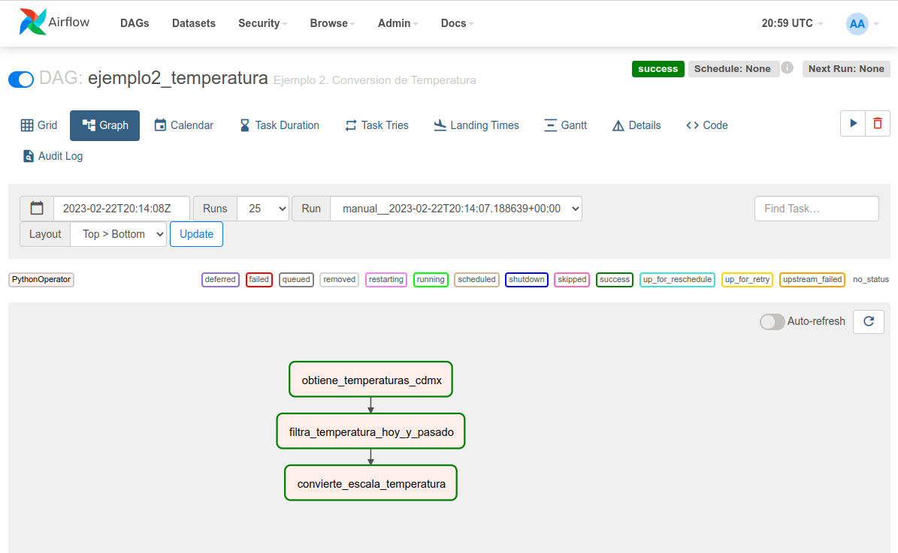

# Ejemplo 2 - Tareas de flujo

En este ejemplo vamos a crear un DAG que se conecta a la API pública [Weather Forecast](https://open-meteo.com/en/docs#latitude=19.43&longitude=-99.13&hourly=temperature_2m), para obtener la predicción de la temperatura en la Ciudad de México en los siguientes 6 días.

## Objetivo

* Crear una **tarea de flujo** para obtener los datos de predicción
* Crear una **tarea de flujo**  para filtrar la temperatura actual y la de pasado mañana
* Crear una **tarea de flujo** para transformar la temperatura de Celsius a Farenheit

## Desarrollo

1. Abrir VS Code
2. Abrir la carpeta `airflow` como espacio de trabajo
3. Copiar el archivo [`Sesion-03/Ejemplo-02/assets/dags/temperatura.py`](/Sesion-03/Ejemplo-02/assets/dags/temperatura.py) al directorio de trabajo dentro de la carpeta `dags`.
4. Ir a la interfaz de Airflow [http://localhost:8080](localhost:8080)
5. Seleccionar el dag `ejemplo2_temperatura` de la lista
6. Activar el DAG
7. Disparar el DAG
8. Una vez terminada la ejecución, hacer click en cada una de las tareas y explorar los resultados del log y los XCom.
