## Sesión 3: Pipeline en Airflow


### 1. Objetivos

- Paso de mensajes entre tareas con XCom
- Utilizar tareas de flujo con el decorador @task
- Crear conexiones con herramientas de datos externas
- Utilizar paquetes de terceros
- Crear tareas de forma dinámica


### 2. Contenido


En este módulo vamos a utilizar operadores de terceros, crearemos un par de conexiones usando la interfaz de Airflow y compartiremos mensajes entre tareas. También aprenderemos una manera simplificada de crear tareas de Python y cómo crear DAGs complejos de forma dinámica.

---
### Tema 1. Paso de mensajes entre tareas con XCom

Para ejemplificar el paso de mensajes entre tareas, usaremos una API de predicción del clima llamado [Open-Meteo](https://open-meteo.com/en/docs#latitude=19.43&longitude=-99.13&hourly=temperature_2m).

Open-Meteo te permite seleccionar una ciudad y la(s) variables(s) del clima en la(s) que estamos interesados.

La [documentación](https://open-meteo.com/en/docs#latitude=19.43&longitude=-99.13&hourly=temperature_2m) de la API proporciona una interfaz web que construye la API URL en base a las opciones seleccionadas.

Después de seleccionar la variable `Termperature (2 m)` y la ciudad `Mexico City` obtenemos la siguiene API URL: https://api.open-meteo.com/v1/forecast?latitude=19.43&longitude=-99.13&hourly=temperature_2m

Este es un ejemplo de la respuesta en formato `JSON` ejecutando el comando `curl` desde la terminal

```bash
curl -L "https://api.open-meteo.com/v1/forecast?latitude=19.43&longitude=-99.13&hourly=temperature_2m"
```

```json
{
  "latitude": 19.375,
  "longitude": -99.125,
  "generationtime_ms": 0.1798868179321289,
  "utc_offset_seconds": 0,
  "timezone": "GMT",
  "timezone_abbreviation": "GMT",
  "elevation": 2238,
  "hourly_units": {
    "time": "iso8601",
    "temperature_2m": "°C"
  },
  "hourly": {
    "time": [
      "2023-02-26T00:00",
      "2023-02-26T01:00",
      "2023-02-26T02:00",
      "2023-02-26T03:00",
      ...
    ],
    "temperature_2m": [
      22.4,
      19.9,
      17.4,
      15.9,
      ...    
    ]
  }
}
```

Podemos notar que los datos que buscamos se encuentran dentro del objeto `hourly` y que la temperatura está en grados Celcius.

```json
"hourly": {
    "time": [...]
    "temperature_2m" : [...]
}
```

Después de explorar los datos fuente podemos empezar a diseñar y a construir nuestro DAG. Este DAG tendrá tres tareas:

- **Tarea 1**. Obtiene el pronóstico de temperaturas por cada hora de los próximos 6 días
- **Tarea 2**. Filtra las temperaturas para obtener sólo dos valores, el del día de hoy y el de pasado mañana correspondientes a la hora de ejecución del DAG.
- **Tarea 3**. Convertir este par de valores a grados Farenheit

Esta es la representación de grafo de las tareas anteriores

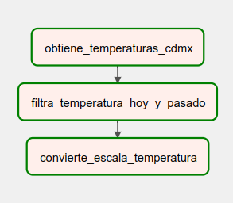

Paso 1. Obtenemos el pronóstico de temperaturas

1. Creamos un nuevo archivo DAG llamado `temperatura.py`
2. Importamos el módulo de `PythonOperator`, `requests` y otras clases para manipulación de objetos de tiempo. 

    ```python
    from airflow import DAG
    from airflow.operators.python import PythonOperator

    import pendulum
    import requests
    from datetime import datetime, timedelta
    import logging
    ```

3. Creamos una función de Python que realice la solicitud a la API y envié el resultado al XCom

    ```python
    API = "https://api.open-meteo.com/v1/forecast?latitude=19.43&longitude=-99.13&hourly=temperature_2m"

    def _obtiene_temperatura_cdmx():
        return requests.get(API).json()['hourly']

    ```

4. Declaramos un DAG y un PythonOperator para llamar a la funcion `_obtiene_temperatura_cdmx`

    ```python
    with DAG(
        dag_id="ejemplo2_temperatura",
        start_date=pendulum.datetime(2023, 1, 15, tz="UTC"),deberá ejecutarse por primera vez
        schedule=None,                                             
    ) as dag:
        obtiene_temperatura = PythonOperator(
            task_id='obtiene_temperaturas_cdmx',
            python_callable=_obtiene_temperatura_cdmx
        )
    ```

5. Activamos y ejecutamos el DAG
6. Revisamos la salida XCom de la tarea `obtiene_temperaturas_cdmx`

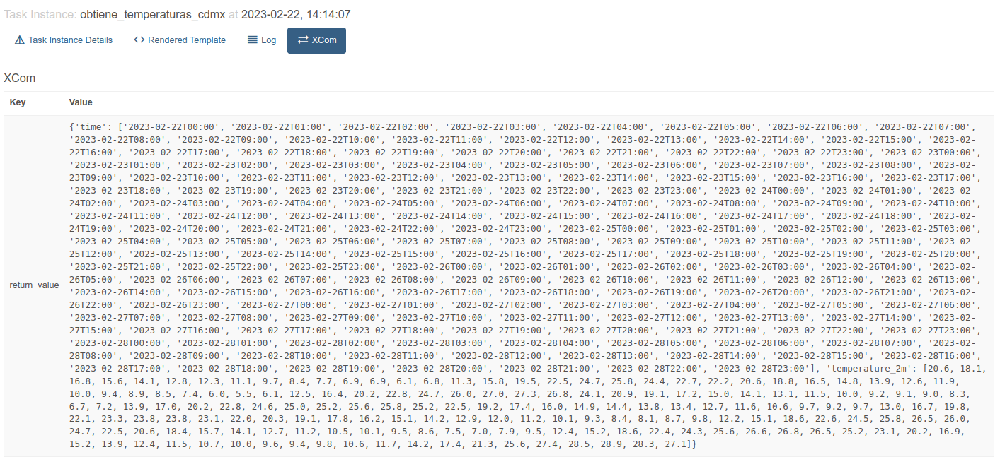

Paso 2. Filtramos los valores de temperatura

1. Escribimos una función Python para transformar el objeto `hourly` en un simple diccionario con dos fechas y valores

    ```python
    def _filtra_temperatura_hoy_y_pasado(ti, ts_nodash, **kwarg):
        data = ti.xcom_pull(task_ids='obtiene_temperaturas_cdmx') #①
        logging.info(data)
        hoy = datetime.strptime(ts_nodash,'%Y%m%dT%H%M%S')        # ②
        futuro = hoy + timedelta(days=2)    
        str_hoy = hoy.strftime("%Y-%m-%dT%H:00")                  # ③
        str_futuro = futuro.strftime("%Y-%m-%dT%H:00")
        temperatura = dict(zip(data['time'], data['temperature_2m'])) # ④
        filtrado  = {k:v for k,v in temperatura.items() if k in [str_hoy, str_futuro]} # ⑤
        ti.xcom_push(key='hoy_y_pasado_celsius', value=filtrado)
    ```

    1. Leemos del XCom el objeto `hourly`
    2. Utilizaremos la variable de entorno de Airflow, `ts_nodash`, que contiene la fecha y hora de ejecución logicas del DAG.
    3. A partir de esta marca de tiempo obtenemos las llaves del día actual y el de pasado mañana, ejemplos: `'2023-02-24T07:00'` y `'2023-02-26T07:00'`
    4. Transformas el objecto `hourly` en un diccionario
    5. Construimos un nuevo diccionario filtrando las llaves de hoy y pasado mañana

    > Más información sobre las variables de Airflow [aquí](https://airflow.apache.org/docs/apache-airflow/stable/templates-ref.html)

2. Declaramos el `PythonOperator` para llamar a la función `_filtra_temperatura_hoy_y_pasado`

    ```python
    filtra_dias = PythonOperator(
        task_id ='filtra_temperatura_hoy_y_pasado',
        python_callable=_filtra_temperatura_hoy_y_pasado
    )
    ```

3. Agregamos esta tarea al código del paso 1
4. Creamos una relación de dependencia entre `obtiene_temperatura` y `filtra_dias`

    ```python
    obtiene_temperatura >> filtra_dias
    ```

5. Activamos y ejecutamos el DAG
6. Revisamos el XCom de la nueva tarea agregada, `filtra_dias`

    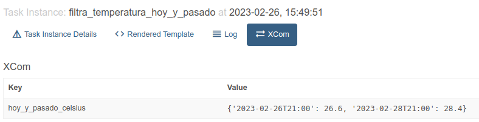

Paso 3. Convertimos las temperaturas a grados Farenheit

1. Definimos una función que apliqué la siguiente formula `°F = (°C x 1.8) + 32`

    ```python
    def _convierte_escala_temperatura(ti):
        data = ti.xcom_pull(task_ids='filtra_temperatura_hoy_y_pasado', key='hoy_y_pasado_celsius')
        convertido = {k: (v * 1.8) + 32  for k,v in data.items() }
        ti.xcom_push(key='hoy_y_pasado_farenheit', value=convertido)
    ```

2. Agregamos un `PythonOperator` para realizar la conversión

    ```python
    convierte_escala = PythonOperator(
        task_id ='convierte_escala_temperatura',
        python_callable=_convierte_escala_temperatura
    )
    ```

3. Agregamos otra relación entre `filtra_dias` y `convierte_escala`

    ```python
    filtra_dias >> convierte_escala
    ```

4. Revisamos el XCom

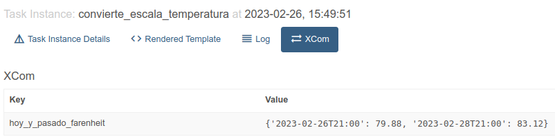


---
### Tema 3. Manejo de conexiones en Airflow

No podemos hablar de data pipelines modernos sin mencionar los servicios de nube, usaremos los servicios de data warehouse (Redshift) y almacenamiento (S3) que ofrece AWS para desarrollar el tema.

Vamos a crear un par de conexiones para que Airflow pueda autenticarse con Redshift y S3.

Empezaremos con Redshift

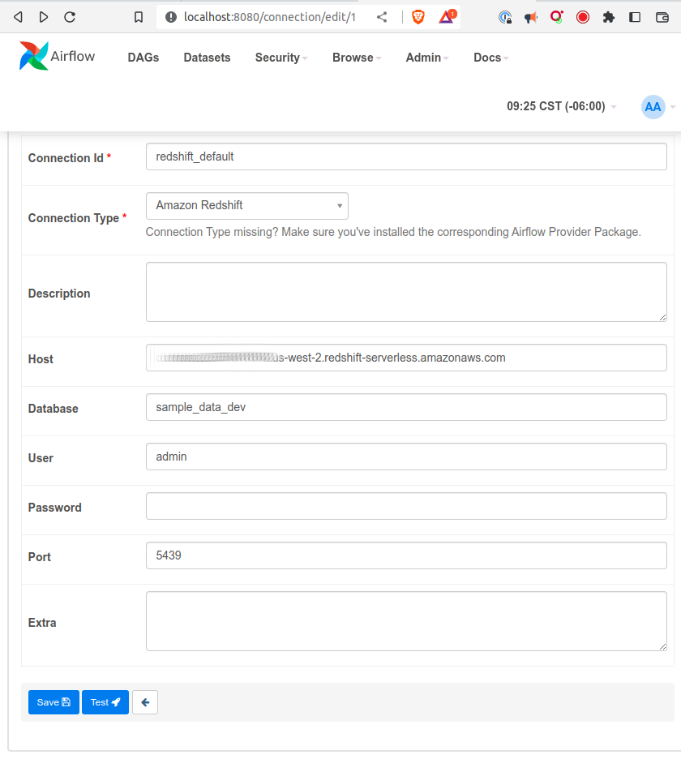

1. Ir a **Admin > Connections**
2. Clic en el botón `[+]`
3. Seleccionar la opción `Amazon Redshift` en la lista desplegable `Connection Type`
4. Especificar los siguientes valores:
    - host
    - database
    - user
    - password
    - port
5. Click sober el botón `Test`

> Nota: Es importante que el servicio de Redshift permita conexiones desde el exterior. Los detalles de esta configuración están fuera del alcance de este curso.

Para habilitar el acceso a otros servicios de AWS, como S3, necesitamos crear una conexión más generica, de tipo `Amazon Web Services`

1. Ir a **Admin > Connections**
2. Clic en el botón `[+]`
3. Seleccionar la opción `Amazon Web Services` en la lista desplegable `Connection Type`
4. Usar el campo `Extra` y un objeto `JSON` para configurar esta conexión

    ```json
    {"aws_access_key_id": "",
    "aws_secret_access_key": "", 
    "region_name": ""}
    ```

5. Click en el boton `Test`

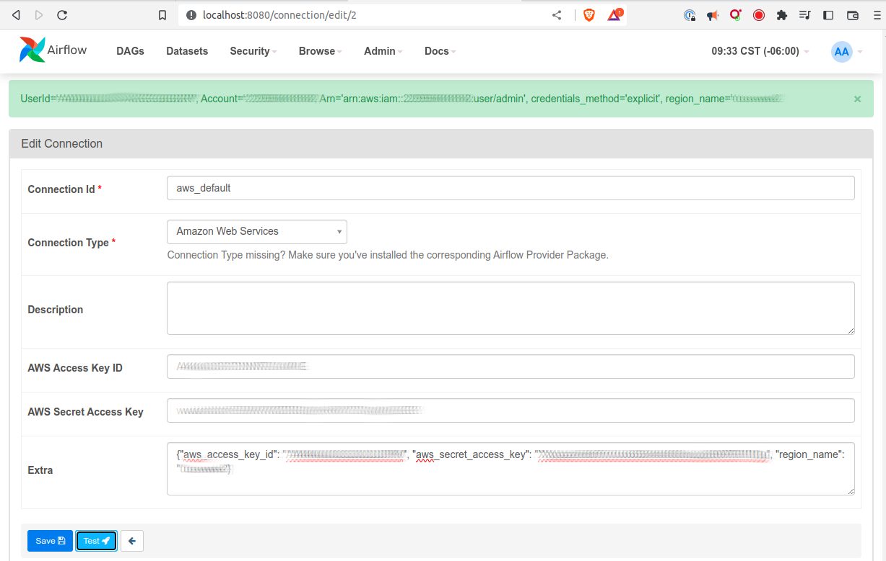

---

### Tema 4. Integración con servicios de la nube

Asumiendo que ya hemos creado y probado existosamente las conexiones `aws_default` y `redshift_default`, vamos a crear un DAG llamdo `redshift` que ejemplifique el uso de tres de los operadores disponibles en el [paquete de AWS](https://registry.astronomer.io/providers/amazon):

- RedshiftSQLOperator
- S3ToRedshiftOperator
- RedshiftToS3Operator

> **Tip**: Si instalas el módulo del proveedor en tu ambiente de desarrollo podrás tener acceso a la documentación desde VS Code. `pip install apache-airflow-providers-amazon==7.1.0`

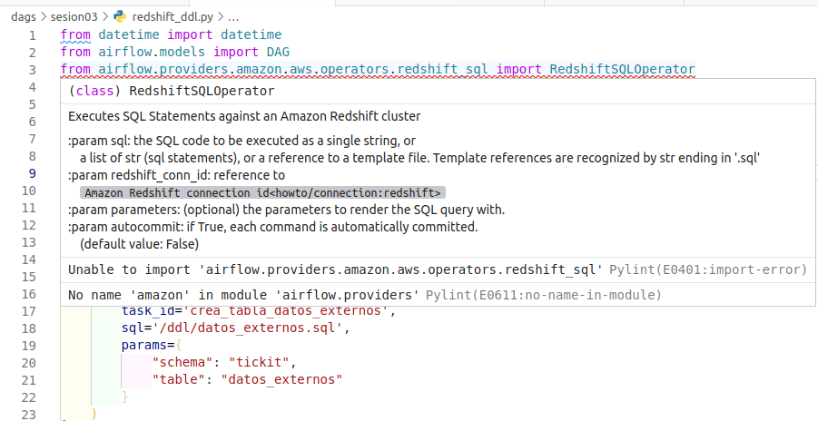

### Preparación

En esta ocasión crearemos varios archivos `.sql` para organizar y mantener el DAG legible. Para ello necesitamos que una nueva carpeta, `includes`, este disponible para los workers de Airflow.

1. cd `~/repo/airflow`
2. Creamos un directorio nuevo `mkdir includes`
3. El árbol de directorios ahora debe ser igual al siguiente:

    ```bash
    tree -L 1 -d
    airflow
    ├── dags
    ├── includes
    ├── logs
    └── plugins
    ```

4. Agregamos una nueva linea a la definición de `docker-compose.yaml` para montar un nuevo directorio.

    Puedes usar el siguiente comando o agregarla manualmente.

    ```bash
    sed -i \
    '/\/plugins:\/opt\/airflow\/plugins/a/s/s/s/s- ${AIRFLOW_PROJ_DIR:-.}/includes:/opt/airflow/includes' \
    docker-compose.yaml 
    ```

    Así es como queda después de editarlo

    ```yaml
    volumes:
    - ${AIRFLOW_PROJ_DIR:-.}/dags:/opt/airflow/dags
    - ${AIRFLOW_PROJ_DIR:-.}/logs:/opt/airflow/logs
    - ${AIRFLOW_PROJ_DIR:-.}/plugins:/opt/airflow/plugins
    - ${AIRFLOW_PROJ_DIR:-.}/includes:/opt/airflow/includes
    ```

5. Reiniciamos los servicios, `docker-compose restart`

6. (Opcional) Verificamos que la carpeta se montó correctamente
    - Asumiendo que tenemos instalado el paquete de extensión de Docker, abrimos explorador de docker
    - En la lista de contenedores, encontraremos un grupo de contenedores agrupados bajo el nombre de airflow
    - Hacemos click derecho sobre el contenedor `apache/airflow:2.5.1 airflow-airflow-worker-1`
    - Seleccionamos la opción `Attach Shell`
    - En la terminal que se abrió, escribimos el comando `ls -D`
    - Comprueba que la carpeta `includes` sea uno de los directorios listados

    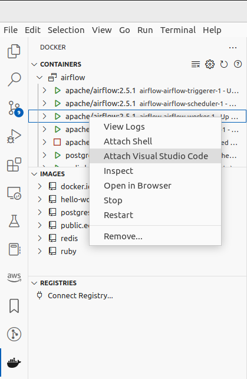

### RedshiftSQLOperator

Utilizaremos `RedshiftSQLOperator` para crear la tabla `tickit.datos_externos` con el siguiente esquema:

```sql
create table if not exists {{ params.schema }}.{{ params.table }} (
	firstname varchar(30),
	lastname varchar(30),
	total_quantity int,
	date_key datetime
) sortkey(date_key);
```

1. Desde el directorio de `airflow`, creamos un par de directorios:

    ```bash
    mkdir -p redshift/ddl && mkdir -p redshift/sql
    ```

2. El arbol de directorios debe ser igual a este:

    ```bash
    includes
    └───redshift
        ├── ddl        
        └── sql
    ```

3. Creamos el archivo `includes/redshift/ddl/datos_externos.ddl` usando la definición de esquema anterior.

4. Importamos el módulo correspondiente a la clase `RedshiftSQLOperator`, así como el resto de dependencias

    ```python
    from airflow.models import DAG
    from airflow.providers.amazon.aws.operators.redshift_sql import RedshiftSQLOperator
    from datetime import datetime
    ```

5. Instanciamos un DAG nuevo especificando la ruta en la que Airflow debe buscar los archivos plantilla

    ```python
    INCLUDE_DIR = '/opt/airflow/includes'
    with DAG(
        dag_id=f"redshift_ddl",
        schedule="@daily",
        start_date=datetime(2023, 2, 24),
        max_active_runs=1,
        template_searchpath=f'{INCLUDE_DIR}/redshift',
        catchup=False
    ) as dag:
    ```

6. Creamos una tarea `RedshiftSQLOperator` pasando la ruta relativa del archivo `.sql` que queremos ejecutar, así como un diccionario con los valores que se usarán para sustituir los parámetros de la plantilla.

    ```python
    redshift_ddl = RedshiftSQLOperator(
        task_id='crea_tabla_datos_externos',
        sql='/ddl/datos_externos.sql',
        params={
            "schema": "tickit",
            "table": "datos_externos"
        }
    )
    ```

7. Crea un archivo DAG con estos bloques de código o copia la versión completa [parte3_redshift.py](Ejemplo-01/assets/dags/redshift_ddl.py).
8. Activa y ejecuta el dag `redshift_ddl`
9. Explora la salida renderizada de dicha tarea
    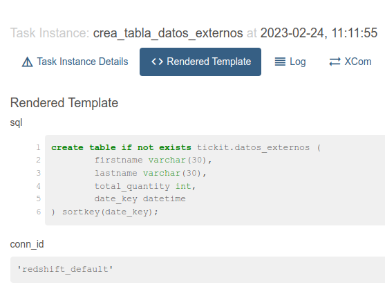

### RedshiftToS3Operator

Supongamos que queremos guardar los resultados de una consulta en un archivo CSV dentro de un bucket de S3.

1. Importamos el módulo correspondiente

    ```python
    from airflow.providers.amazon.aws.transfers.redshift_to_s3 import RedshiftToS3Operator
    ```

2. Guardamos en una variable la consulta que deseamos ejecutar

    ```python
    EXPORT_QUERY = """SELECT
        firstname,
        lastname,
        total_quantity,
        cast(\\'{{ ds }}\\' as date)  as ds
    FROM (
        SELECT buyerid, sum(qtysold) total_quantity
        FROM  tickit.sales
        GROUP BY buyerid
        ORDER BY total_quantity desc limit 10
    ) Q, tickit.users
    WHERE
        Q.buyerid = userid
    ORDER BY Q.total_quantity desc
    """
    ```

3. Ahora usamos el operador `RedshiftToS3Operator` para definir los parámetros del comando `UNLOAD`

    ```python
    BUCKET_NAME = 'airflow-redshift-demostracion'
    query_to_s3 = RedshiftToS3Operator(
            task_id='descarga_reporte_de_ventas_de_redshift_a_s3',
            s3_bucket=BUCKET_NAME,
            s3_key='reporte/ventas/{{ ds }}_',
            select_query=EXPORT_QUERY,
            redshift_conn_id='redshift_default',
            aws_conn_id='aws_default',
            table_as_file_name=False,
            unload_options=[
                "DELIMITER AS ','",
                "FORMAT AS CSV",
                "ALLOWOVERWRITE",
                "PARALLEL OFF",
                "HEADER"
            ]
        )
    ```

    > NOTA: Este operador usa dos conexiones, `redshift_default` y `aws_default`, ya que necesita acceso tanto acceso a Redshift como al bucket de S3.

4. Crea un archivo DAG con estos bloques de código o copia la versión completa [redshift_unload.py](Ejemplo-01/assets/dags/redshift_unload.py).
5. Activa y ejecuta el dag `redshift_unload`
6. Explora la salida renderizada de dicha tarea
    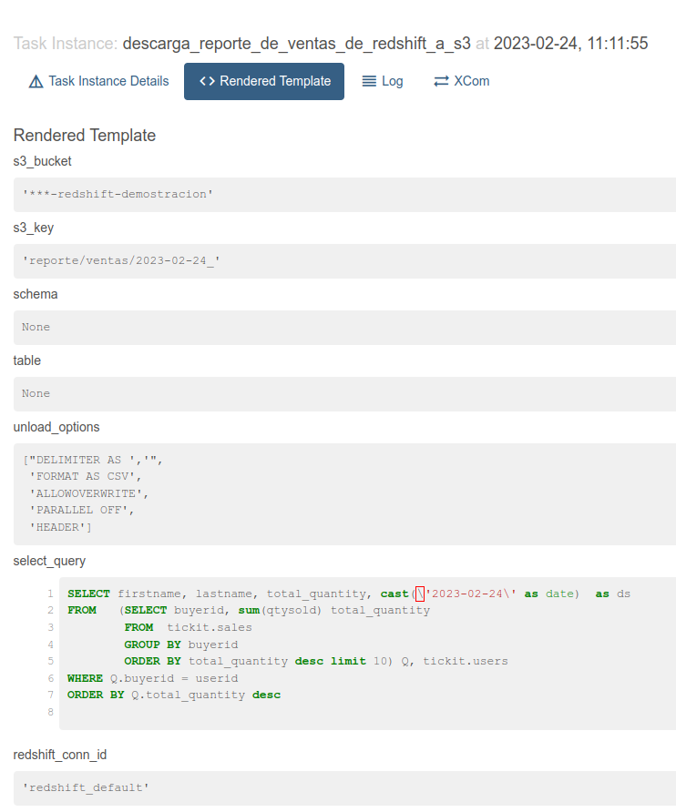
7. Revisa los mensajes del log para consultar el SQL generado. Ejemplo:

    ```sql
    UNLOAD (
        'SELECT firstname, lastname, total_quantity, cast(\'2023-02-24\' as date)  as ds
        FROM  (
            SELECT buyerid, sum(qtysold) total_quantity
            FROM  tickit.sales
            GROUP BY buyerid
            ORDER BY total_quantity desc limit 10
        ) Q, tickit.users
        WHERE Q.buyerid = userid
        ORDER BY Q.total_quantity desc'
    )
    TO 's3://***-redshift-demostracion/reporte/ventas/YYYY-MM-DD_'
    credentials 'aws_access_key_id=<your-key-id>;aws_secret_access_key=***'
    DELIMITER AS ','
    FORMAT AS CSV
    ALLOWOVERWRITE
    PARALLEL OFF
    HEADER
    ;
    ```

8. Verifica que los archivos se hayan creado en `s3://***-redshift-demostracion/reporte/ventas/YYYY-MM-DD_*`

> **Nota**: Verifica que tu servicio de Redshift cuente con los roles necesarios para escribir en el bucket destino.

### S3ToRedshiftOperator

Para cargar datos de S3 a Redshift utilizaremos el operador `S3ToRedshiftOperator`, este operador ejecuta el comando `COPY`

1. Primero importamos el módulo correspondiente

    ```python
    from airflow.providers.amazon.aws.transfers.s3_to_redshift import S3ToRedshiftOperator
    ```

2. Definimos el esquema y la tabla destino, así como el nombre del bucket y el prefijo en dónde se encuentran los archivos CSV que deseamos cargar.

    ```python
    s3_to_redshift = S3ToRedshiftOperator(
        task_id='carga_archivo_de_s3_a_redshift',
        schema='tickit',
        table='datos_externos',
        s3_bucket=BUCKET_NAME,
        s3_key='reporte/ventas/',
        redshift_conn_id='redshift_default',
        aws_conn_id='aws_default',
        copy_options=[
            "DELIMITER AS ','",
            "IGNOREHEADER 1"
        ],
        method='REPLACE'
    )
    ```

3. Crea un archivo DAG con estos bloques de código o copia la versión completa [redshift_copy.py](Ejemplo-01/assets/dags/redshift_copy.py).
4. Activa y ejecuta el dag `redshift_copy`
5. Explora la salida renderizada de dicha tarea
    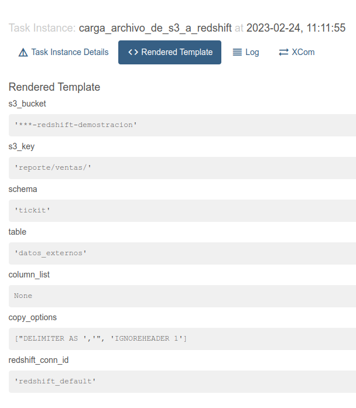
6. Revisa los mensajes del log para consultar el SQL generado. Ejemplo:

    ```sql
    COPY tickit.datos_externos 
    FROM 's3://***-redshift-demostracion/reporte/ventas/'
        credentials 'aws_access_key_id=<your-key-id>;aws_secret_access_key=***'
    DELIMITER AS ','
    IGNOREHEADER 1;
    ```

7. Comprueba que los archivos ubicados en CSV `s3://***-redshift-demostracion/reporte/ventas/YYYY-MM-DD_*` hayan sido insertados en la tabla `tickit.datos_externos`

    ```sql
    select * from tickit.datos_externos;
    ```

> **Nota 1**: Verifica que tu servicio de Redshift cuente con los roles necesarios para leer desde el bucket origen.

> **Nota 2**: Puedes usar la siguiente consulta en Redshift para encontrar posibles errores de carga

    SELECT query_id,
        table_id,
        start_time,
        trim(file_name) AS file_name, 
        trim(column_name) AS column_name, 
        trim(column_type) AS column_type, 
        trim(error_message) AS error_message 
    FROM sys_load_error_detail 
    ORDER BY start_time  desc
    LIMIT 10;
        

- [**`EJEMPLO 1`**](./Ejemplo-01)

---


### 3. Postwork :memo:

Encuentra las indicaciones y consejos para reflejar los avances de tu proyecto de este módulo.

- [**`POSTWORK SESIÓN 1`**](./Postwork/)

<br/>


</div>

