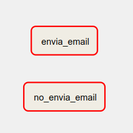

# Ejemplo # - Notificaciones por email

## Objetivo

* Configurar notificaciones por correo disparadads por:
    - errores
    - reintentos

## Desarrollo



### Parte I

1. Verifica que tu conexión de correo funcione correctamente, usando el [ejemplo de la sesión 4](Sesion-04/Ejemplo-07/assets/dags/s04_e07_correo.py).


2. Crea un nuevo arhivo DAG
3. Define un diccionario de argumentos por default que luego pasarás como parámetro al DAG

    ```python
    default_args = {
        "owner": "airflow",   
        "email_on_failure": False,
        "email": ["destinario@verificado.com"],
        "retries": 0
    }

    @dag(
        default_args=default_args,
        schedule=None,
        start_date=pendulum.datetime(2023, 3, 30, tz="UTC"),
        catchup=False
    )
    ```

4. Crea dos tareas Bash en paralelo que regresen el código de error 1.

    ```python
    def notificacion_por_email():
    no_envia_email = BashOperator(
        task_id="no_envia_email",
        bash_command="exit 1",
        )

    envia_email = BashOperator(
        task_id="envia_email",
        bash_command="exit 1",
        email_on_failure=True)
    ```
5. Revisa la salida del log de ambas tareas y encuentra las diferencias
6. Consulta la bandeja de entra del destinario de correo que especificaste y comprueba que hayas recibido un correo con el asunto parecido al siguiente:

    ```html
    Airflow alert: <TaskInstance: notificacion_por_email.envia_email manual__2023-04-23T17:27:05.304832+00:00 [failed]>
    ```
[s06_e01_email_on_failure.py](/Sesion-06/Ejemplo-01/dags/s06_e01_email_on_failure.py)

### Parte II

Ahora habilitaremos la opción de reintentos y verificaremos que recibimos un correo por cada ejecución fallida.

1. Modifica la tarea `envia_email` para permitir 3 reintentos antes de marcar la tarea como fallida, usando espacios de 1 minuto entre cada reintento.

    ```python
    from datetime import timedelta
    ...
    envia_email = BashOperator(
        task_id="envia_email",
        bash_command="exit 1",
        retries=3,
        retry_delay=timedelta(minutes=1),
        email_on_failure=True)
    ```

2. Ejecuta el DAG y monitorea su comportamiento usando la vista de Grafo.
3. Verifica la rececpción de los correos por cada intento
4. ¿Cuántos correos recibiste?

[s06_e01_email_on_failure_con_reintentos.py](/Sesion-06/Ejemplo-01/dags/s06_e01_email_on_failure_con_reintentos.py)

