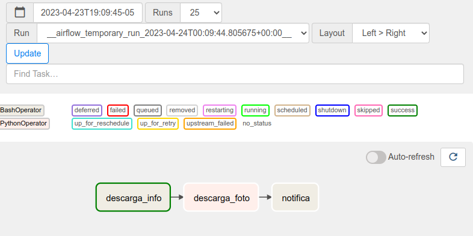
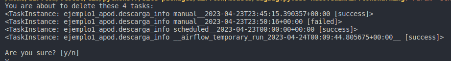
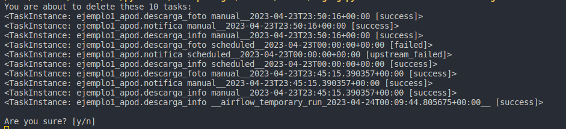

# Ejemplo # - Línea de Comandos de Airflow

## Objetivo

* Usar comandos de airflow para realizar pruebas de tareas
* Administrar variables y conexiones

[cheat_sheet](/Sesion-06/Ejemplo-03/assets/cheat_sheet.md)

## Desarrollo

### Parte I

#### DAGs

Ejecutaremos una serie de comandos para realizar alguna de las acciones que antes solo podiamos hacer a través de la interfaz web de Airflow.

1. Buscaremos la ubicación del archivo DAG con el `dag_id-ejemplo_redshift`

    ```bash
    airflow  dags list | grep basic_apod    
    ```

    |dag_id                                 | filepath                                               | owner   | paused|
    |-|-|-|-|
    |ejemplo1_apod                       | sesion02/apod.py                                   | airflow | True |

    > Nota: para filtrar el resultado estamos utilizando el comando [grep](https://www.hostinger.mx/tutoriales/comando-grep-linux) de linux

2. Notamos que el DAG esta pausado, así que lo activamos

    ```bash
    airflow dags unpause ejemplo1_apod
    ```

3. Revisamos las siguientes ejecuciones del DAG, si es que está programado para ejecutarse

    ```bash
    airflow dags next-execution ejemplo1_apod
    ```

4. Revisamos las últimas ejecuciones del DAG

    ```bash
    airflow dags list-runs --dag-id ejemplo1_apod
    ```

5. Si queremos ejecutar el DAG sin generar ningún registro en el metastore, ejecutamos el siguiente comando

    ```bash
    airflow dags test ejemplo1_apod
    ```

6. Ejecutamos el DAG de forma manual

    ```bash
    airflow dags trigger ejemplo1_apod
    ```

    ```bash
    Created <DagRun ejemplo1_apod @ 2023-04-23T23:50:16+00:00: manual__2023-04-23T23:50:16+00:00, state:queued, queued_at: 2023-04-23 23:50:16.557435+00:00. externally triggered: True>
    ```

7. Si queremos comprobar el estado del DAG de la ejecución, copiamos la fecha de ejecución del DagRun y lo pasamos como parámetro posicional después del `dag_id`

    ```bash
    airflow dags state ejemplo1_apod "2023-04-23T23:50:16+00:00"
    ```


#### Tareas

Ahora ejecutaremos algunos comandos a nivel de tareas

1. Listamos las tareas de un dag

    ```bash
    airflow tasks list ejemplo1_apod
    ```

2. Mostamos el estado de estas tareas usando una fecha de ejecución en particular

    ```bash
    airflow tasks states-for-dag-run ejemplo1_apod "2023-04-23T23:50:16+00:00"
    ```

|dag_id        | execution_date            | task_id       | state   | start_date                       | end_date|
|-|-|-|-|-|-|
|ejemplo1_apod | 2023-04-23T23:50:16+00:00 | descarga_info | success | 2023-04-23T23:51:29.636898+00:00 | 2023-04-23T23:51:30.767481+00:00
|ejemplo1_apod | 2023-04-23T23:50:16+00:00 | descarga_foto | success | 2023-04-23T23:51:32.132741+00:00 | 2023-04-23T23:51:33.212662+00:00
|ejemplo1_apod | 2023-04-23T23:50:16+00:00 | notifica      | success | 2023-04-23T23:51:34.856683+00:00 | 2023-04-23T23:51:35.433436+00:00

3. Si alguna de nuestras tareas usa plantillas, podemos ver el resultado sin ejecutar la tarea

    ```bash
    airflow tasks render ejemplo1_apod descarga_info "2033-04-23"
    ```

4. Para ejecutar una tarea sin generar registros en el metastore

    ```bash
    airflow tasks test ejemplo1_apod descarga_info
    ```

5. Para ejecutar una tarea ignorando sus dependencias

    ```bash
    airflow tasks run ejemplo1_apod descarga_info
    ```
    

6. Para limpiar una tarea a partir de una fecha de ejecución específica

    ```bash
    airflow tasks clear ejemplo1_apod -t descarga_info -s "2023-04-23"
    ```

    

7. Para limpiar esa tarea y sus descendientes agregamos la bandera `-d`

    ```bash
    airflow tasks clear ejemplo1_apod -t descarga_info -d -s "2023-04-23"
    ```

    


### Parte II

En este ejemplo vamos a exportar las variables que hayamos creado mediante la interfaz web de Airflow: `Admin > Connection`

1. Ejecutamos el siguiente comando

    ```bash
    airflow variables export my_variables.json
    ```

2. Se creara un archivo `my_variables.json`, cuyo contenido podemos listar como sigue `cat my_variables.json`

    > En este ejemplo se muestran 4 variables: `config_apod`, `foo`, `municipios` y `regiones`.

    ```json
    {
        "config_apod": [
            "hi",
            "foo",
            "bar"
        ],
        "foo": "{'bar':5}",
        "municipios": [
            1,
            2,
            3,
            4,
            5,
            6,
            7,
            8,
            9,
            10,
            11,
            12,
            13,
            14,
            15,
            16,
            17,
            18,
            19,
            20,
            21
        ],
        "regiones": [
            1,
            2
        ]
    }
    ```

3. Ahora eliminaremos la variable `config_apod`

    ```bash
    airflow variables delete config_apod
    ```

4. Comprobamos que la variable ha sido eliminida

    ```bash
    airflow variables list
    ```

5. Creamos nuevamente la variable

    ```bash
    airflow variables set -j "config_apod" '["hi", "foo", "bar"]'
    ```    

6. Consultamos el valor de la variable que acabamos de agregar

    ```bash
    airflow variables get config_apod
    ```

7. Importamos el contenido del archivo `my_variables.json`

    ```bash
    airflow variables import my_variables.json
    ```

> Nota: podemos hacer lo mismo con las conexiones a través del comando `airflow connections` y los subcomandos `add`, `delete`, `export`, `get`, `import` y `list`; ya que funcionan de la misma manera.