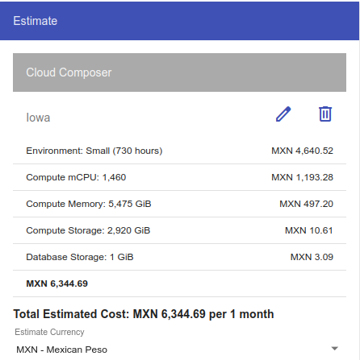
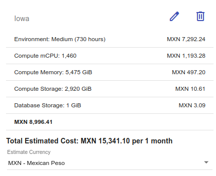
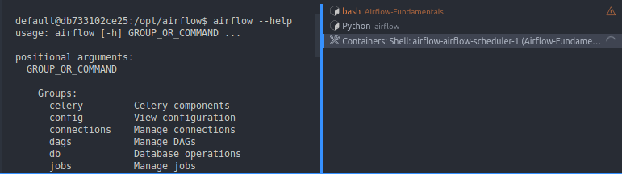

## Sesión 6: Entornos de producción

### 1. Objetivos 🎯 

- Enviar mensajes de alerta a través de:
    - Email
    - Slack
- Familiarizarse con la línea de comandos de Airflow

### 2. Contenido 📚

En un entorno de producción, estar al tanto del estado los pipelines, sobre todo aquéllos que son recurrentes, es crucial para mantener el flujo de los datos constante y sin errores.

---
#### <ins>Tema 1. Airflow en la nube</ins>

Utilizaremos la [calculadora](https://cloud.google.com/products/calculator?hl=es-419#id=0e73c2c7-ab05-4cbf-8e63-4891cb4f5055) de Google Cloud para cotizar un ambiente de Airflow.

Entre las variables más destacadas se encuentran:

- El tipo de ambiente
- La horas activas promedio por dia/mes
- El número de workers y sus recursos
- El número de planificadores (Schedulers) y sus recursos
- El espacio de almacenamiento para el metastore

Ambiente Small en Iowa



Ambiente Medio en Iowa



> Nota: los costos varían dependiendo de la región que seleccione
#### <ins>Tema 2. Notificaciones</ins>

**Prerequisitos**


- Servidor de correos configurado
- Un espacio de Slack
- Una [aplicación](https://api.slack.com/apps) de Slack con webhook entrantes habilitados.
- Un Webhook entrante a un canal de slack existentene en el espacio de Slack.


> [Aquí](https://api.slack.com/messaging/webhooks) encontrarás un excelente tutorial creado por el equipo de Slack para completar estos dos últimos pasos. 


- [**`EJEMPLO 1. Notificaciones por correo`**](/Sesion-06/Ejemplo-01/README.md)
- [**`EJEMPLO 2. Notificaciones por Slack`**](/Sesion-06/Ejemplo-02/README.md)
- [**`RETO 1. Mensaje de éxito por Slack`**](/Sesion-06/Reto-01/README.md)

---
#### <ins>Tema 3. Interfaz de Línea de Comandos (CLI)</ins>



Ahora exploraremos algunos de los comandos/sub-comandos disponibles a través de la terminal.
Para poder ejecutar estos comandos debemos acceder a alguno de los nodos de Airflow, para ello

1. Abrimos el explorador de contenedores de Docker en VS Code
2. Hacemos click derecho sobre `airflow-airflow-scheduler-1` y seleccionamos la opción `Attach Shell`
3. Se abrirá una nueva terminal `Containers:Shell:airflow-airflow-scheduler-1`, la cual usaremos para ejecutar nuestros comandos.

- [**`EJEMPLO 3. DAGs, tareas y administración de variables`**](/Sesion-06/Ejemplo-03/README.md)
- [**`RETO 2. Administración de conexiones`**](/Sesion-06/Reto-01/README.md)
---


#### <ins>Tema 4. Backfill</ins>

Ya que estamos más familiarizados con la línea de comandos, utilizaremos el comando `backfill`
para simular una carga histórica.

Vamos a ejecutar el dag [hola_mundo](Sesion-01/Ejemplo-02/assets/dags/hola_mundo.py) de la sesión 2.
Este DAG utiliza un operador bash para imprimir la fecha actual.

```python
with DAG(
    dag_id="hola_mundo",
    start_date=pendulum.datetime(2023, 2, 20, tz="UTC"),
    catchup=True,
    schedule='@daily'
) as dag:
    run_this = BashOperator(
        task_id="imprime_fecha",
        bash_command="echo $(date)"
    )
```

1. Ejecutamos el comando de backfill en un rango de fechas inicio y fin en formato `YYYY-MM-DD`

    ```bash
    airflow dags backfill \
    -s '2023-03-10' \
    -e '2023-03-20' \
    hola_mundo
    ```

2. Con ayuda de la vista de cuadrícula (Grid) observamos como se ejecuta el DAG en múltiples fechas de forma simultánea

3. Al revisar los logs de cada uno de las ejecuciones podemos verificar que todas las marcas del tiempo que si imprimen son del dia actual.

4. Para modificar este comportamiento realizamos las siguientes modificaciones:
    - Agregaraemos al DAG el parámetro `max_active_runs=1` para asegurar que los DAGs se ejecuten de forma sequencial, en el orden en el que se agendaron
    - Usamos la macro predefinida `{{ ts }}` para imprimir la fecha de ejecución del DAG

5. Ejecutamos nuevamente el comando backfill para el DAG con los cambios

    ```bash
    airflow dags backfill \
    -s '2023-03-10' \
    -e '2023-03-20' \
    max_active_runs
    ```

6. Verificamos en la vista Grid que la ejecución sea secuencial y que las marcas de tiempo coincidan con la fecha de ejecución

> Nota: para que proceso de backfill funcione como se espera los parámetros de tiempo deben estar en función de las fechas logicas de ejecución del DAG, por ejemplo: `{{ ds }}`, `{{ ds_nodash }}`, `{{ ts }}`, etc.

[s06_e03_max_active_runs.py](Sesion-06/Ejemplo-04/assets/dags/s06_e03_max_active_runs.py)

[**`RETO 3. Carga histórica`**](/Sesion-06/Reto-03/README.md)
### 3. Postwork :memo:


- [**`POSTWORK SESIÓN 1`**](/Sesion-06/Postwork/README.md)

<br/>


</div>

