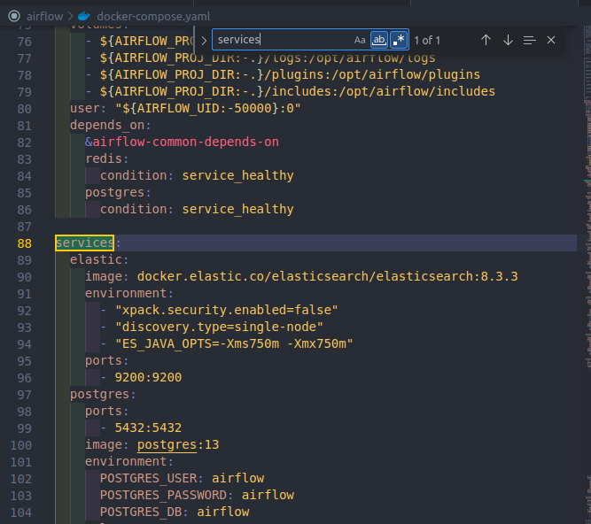
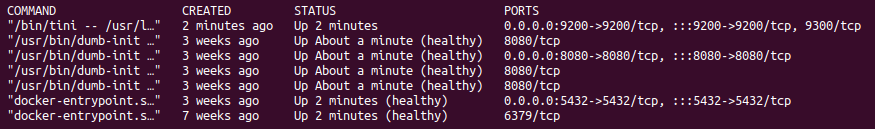
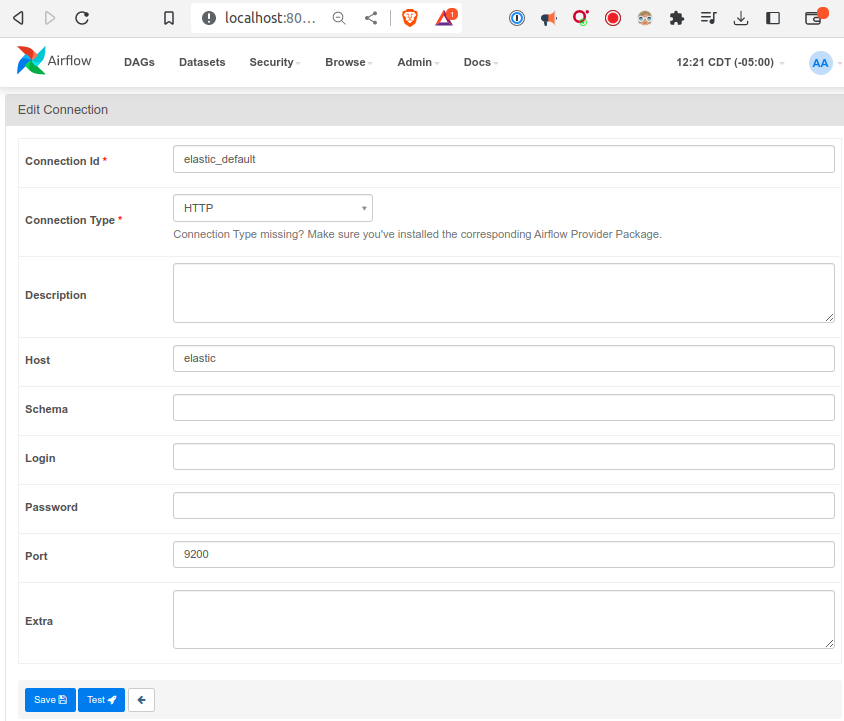
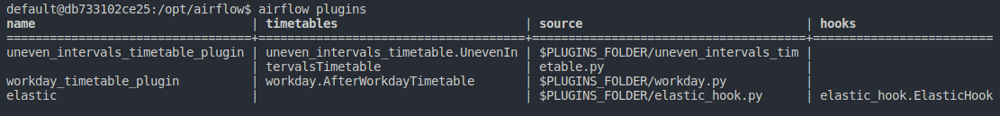

# Ejemplo # - Elastic Search Plugin

## Objetivo

* Mostrar el proceso de creación, registro y uso  de un plugin a través de un servicio externo como Elastic Search


## Preparación

Vamos a ejeuctar ElasticSearch como parte del conjunto de servicios de Ariflow.

1. Modificamos nuestro archivo docker-compose.yaml y agregaremos un servicio nuevo bajo la sección `services` como se mustra a continuación:

    ```yaml
    services:
    elastic:
        image: docker.elastic.co/elasticsearch/elasticsearch:8.3.3
        environment:
        - "xpack.security.enabled=false"
        - "discovery.type=single-node"
        - "ES_JAVA_OPTS=-Xms750m -Xmx750m"
        ports:
        - 9200:9200
    ```

    

2. Reiniciamos los servicios de airflow

    ```bash
    cd airflow
    airflow compose stop
    airflow compose up
    ```

3. Comprobamos que el nuevo servicio se ejecute correctamente

    ```bash
    docker compose ps
    ```
    
    

    > Si expermientamos problemas de recursos, podemos incrementar la cantidad de memoria que Docker puede usar desde la aplicación de Docker, Preferences > Resources.

4. Creamos una conexión a Elasticserach desde la interfaz web de Airflow usando los siguientes parámetros:

    - Connection Id: elastic_default
    - Connection Type: HTTP
    - Host: elastic
    - Port: 9200

    


## Desarrollo

El ejemplo está dividido en dos partes, en la primera creamos y registramos el plugin. En la segunda parte crearemos un archivo DAG y mostraremos cómo utilizarlo.

### Parte I

Creamos una archivo `elastic_hook.py` dentro de la carpeta `plugins`

1. Importamos las clases que utilizaremos en la definición del plugin

    ```python
    from airflow.plugins_manager import AirflowPlugin
    from airflow.hooks.base import BaseHook
    from elasticsearch import Elasticsearch
    ```

    > NOTA: Si deseas conocer más detalles sobre la implementación puedes consultar la documentación del módulo de Python: [Python Elasticsearch Client](https://elasticsearch-py.readthedocs.io/en/v7.13.4/)
2. Definimos una nueva clase `ElasticHook` que tenga como clase base `BaseHook`

    ```python
    class ElasticHook(BaseHook):
        def __init__(self, conn_id='elastic_default', *args, **kwargs):
            super().__init__(*args, **kwargs)
            conn = self.get_connection(conn_id)

            conn_config = {}
            hosts = []

            if conn.host:
                hosts = conn.host.split(',')
            if conn.port:
                conn_config['port'] = int(conn.port)
            if conn.login:
                conn_config['http_auth'] = (conn.login, conn.password)

            self.es = Elasticsearch(hosts, **conn_config)
            self.index = conn.schema
    ```

3. Definimos tres métodos: `info`, `set_index` y `add_doc` para realizar operaciones básicas

    ```python
        def info(self):
            return self.es.info()

        def set_index(self, index):
            self.index = index

        def add_doc(self, index, id, doc, doc_type='_doc'):
            self.set_index(index)
            res = self.es.index(index=index, doc_type=doc_type, id=id, body=doc)
            return res
    ```

4. Ahora registramos el nuevo plugin especificando su nombre y tipo

    ```python
    class AirflowElasticPlugin(AirflowPlugin):
        name = 'elastic'
        hooks = [ElasticHook]
    ```

5. Utiizamos el plugin de docker en VS Code para conectarnos al conentedor del Scheduler
6. Una vez que estemos dentro del contendor ejectuamos el siguiente comando para verificar que nuestro plugin quedó correctamente registrado (columna `hooks`)

    ```bash
    airflow plugins
    ```

    > Nota: En la siguiente imagen se muestran 2 plugins de tipo timetable y el hook que acabamos de agregar

    


### Parte II

A continuación implementaremos un DAG que utilice el nuevo plugin `ElasticHook`

1. Creamos un archivo DAG
2. Importamos las clases del nucleo de airflow y el nuevo hook
    ```python
    from airflow import DAG
    from airflow.operators.python import PythonOperator
    from elastic_hook import ElasticHook
    from datetime import datetime
    ```

3. Definimos el DAG y una tarea de tipo PythonOperator con una función callback `_print_es_info`

    ```python
    with DAG('elastic_dag', start_date=datetime(2022, 1, 1), schedule_interval='@daily', catchup=False) as dag:
    
        print_es_info = PythonOperator(
            task_id='print_es_info',
            python_callable=_print_es_info
        )

    ```

4. En el cuerpo de la función `_print_es_info`, instanciamos la clase `ElasticHook` y llamamos al método `info()`, el cual no hace más que regresar la información del cluster de ElasticSearch
5. Guardamos el DAG, lo activamos y lo ejecutamos
6. Si todo marcha bien podrán ver en el log de la tarea `print_es_info` un mensaje parecido al siguiente:

    ```json
    {'name': 'a91e21b58e20', 
    'cluster_name': 'docker-cluster', 
    'cluster_uuid': '4KGg7Sd5TIK9ROG6agzMTw', 
    'version': {'number': '8.3.3', 
                'build_flavor': 'default', 
                'build_type': 'docker', 'build_hash': '801fed82df74dbe537f89b71b098ccaff88d2c56', 
                'build_date': '2022-07-23T19:30:09.227964828Z', 
                'build_snapshot': False, 
                'lucene_version': '9.2.0', 
                'minimum_wire_compatibility_version': '7.17.0', 'minimum_index_compatibility_version': '7.0.0'}, 
    'tagline': 'You Know, for Search'}
    ```

**Ejemplo 1**

En las siguientes enlaces encontrán las versiones finales, tanto del plugin como del DAG de prueba.

- [elastic_dag.py](/Sesion-07/Ejemplo-01/assets/dags/elastic_dag.py)
- [elastic_hook.py](/Sesion-07/Ejemplo-01/assets/plugins/elastic_hook.py)

---
[`**Reto 01**`]()