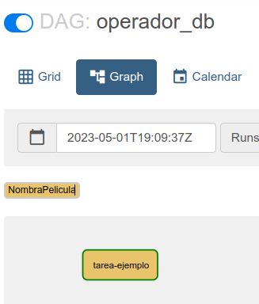

# Ejemplo #2 - Operador de Postgres

## Objetivo

* Crear un operador nuevo
* Utilizar un Hook existente

## Pre-requistos

- La base de ejemplo dvdrental
- Una conexión a Postgres con las siguientes especificaciones

```json
{
  "label": "localhost",
  "host": "localhost",
  "user": "postgres",
  "port": 5432,
  "ssl": false,
  "database": "dvdrental",
  "password": "postgres"
}
```
## Desarrollo


Vamos a crear un operador que se conecte a Postgres y que seleccione una película del catálogo de DVDRentals en base a un genero de entrada.

Esta es la lista de géneros de películas que existen en la base de datos

- Family
- Games
- Animation
- Documentary
- Classics
- Sports
- New
- Children
- Music
- Travel
- Foreign
- Horror
- Drama
- Action
- Sci-Fi
- Comedy


1. Creamos un archivo python `seleccionaPeliculaOperator.py` en dentro de la carpeta `Plugins/operators`
2. Importamos `BaseOperator`, el decorador `@apply_defaults` y el hook `PostgresHook`

    ```python
    from airflow.models import BaseOperator
    from airflow.utils.decorators import apply_defaults

    from airflow.providers.postgres.hooks.postgres import PostgresHook
    ```

3. Definimos una clase nueva derivada de `BaseOperator`

    ```python
    class NombraPelicula(BaseOperator):
        ui_color = "#e9c46a"  #color de fondo del operador en la vista de Grafo
        @apply_defaults            
        def __init__(self, genero: str, postgres_conn_id: str='postgres_default', database: str='dvdrental', **kwargs) -> None:
            super().__init__(**kwargs)
            self.genero = genero # parámetro de entrada
            self.postgres_conn_id = postgres_conn_id
            self.database = database

        def execute(self, context):
            hook = PostgresHook(postgres_conn_id=self.postgres_conn_id, schema=self.database)
            sql = f"""select
                        f.title,
                        f.description
                    from film f
                    inner join film_category fc
                    on (f.film_id = fc.film_id)
                    inner join category c
                    on (fc.category_id = c.category_id)
                    where
                        c.name = '{self.genero}'
                    limit 1
                    ;"""
            connection = hook.get_conn()
            cursor = connection.cursor()
            cursor.execute(sql)
            result = cursor.fetchall()
            cursor.close()
            print(result)
            return result
    ```

4. Creamos un archivo DAG
5. Importamos el nuevo operador

    ```python
    from operators.seleccionaPeliculaOperator import NombraPelicula
    ```

6. Creamos una tarea para probrar el nuevo operador
    
    ```python
    t1 = NombraPelicula(task_id="tarea-ejemplo",
                                postgres_conn_id='postgres',
                                genero="Drama")
    ```

7. Guardamos el archivo DAG, lo activamos y ejecutamos
8. Revisamos el log para verificar que el resultado sea el esperado

En los siguientes enlaces encontrarás las versiones finales del operador y el dag de ejemplo.

* [elije_pelicula.py](/Sesion-07/Ejemplo-02/assets/dags/elije_pelicula.py)
* [seleccionaPeliculaOperator](/Sesion-07/Ejemplo-02/assets/plugins/seleccionaPeliculaOperator.py)
