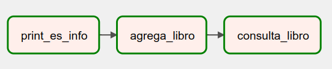

# Reto #1 - Actualizar el plugin de ElasticSearch

## Objetivo

* Familiarizarse con el flujo de desarrollo de plugins modificando el código


## Desarrollo

>**💡 Nota para experto(a)**
>
> Este es un pequeño [tutorial](https://medium.com/codex/elasticsearch-for-dummies-part-1-be184a739b60) para conectarse a ElasticSearch desde VS Code, puede ser una herramienta útil para resolver problemas.
> También agregué el script [query.es](/Sesion-07/Ejemplo-01/assets/query.es) de elastic con ejemplos de operaciones POST y GET.


El reto consiste en modificar el DAG [elastic_dag.py](/Sesion-07/Ejemplo-01/assets/dags/elastic_dag.py) para agregar una tarea que llame al método `ElasticHook.add_doc()` que ya se encuentra implementado en el plugin [elastic_hook.py](/Sesion-07/Ejemplo-01/assets/plugins/elastic_hook.py).


1. Clonar el archivo DAG
2. Crear una tarea nueva `agrega_libro` de tipo PythonOperator o tarea de flujo usando el decorador @dag
3. Implementar el cuerpo de la función
4. Definir la relación entre tareas
5. Ejecutar el DAG y comprobar los resultados

**Puntos Extras**

Ahora implementaremos el método `get_doc` en el plugin [elastic_hook.py](/Sesion-07/Ejemplo-01/assets/plugins/elastic_hook.py), para poder recuper la información de los libros que guardamos anteriormente.

1. Implementer el método `get_doc` en el plugin
2. Crear una tarea de flujo ó PythonOperator `consulta_libro`
3. Implementar la función correspondiente para instanciar la clase `ElasticHook` y llamar al método `get_doc`
4. Imprimir la respuesta del método
5. Ejecutar el pipeline completa y corroborar los resultados.

Ejemplo de uso tomado de la documentación del módulo de [ElasticSearch](https://elasticsearch-py.readthedocs.io/en/v7.13.4/) que estamos usando.

```python
from datetime import datetime
from elasticsearch import Elasticsearch
es = Elasticsearch()

doc = {
    'author': 'kimchy',
    'text': 'Elasticsearch: cool. bonsai cool.',
    'timestamp': datetime.now(),
}
res = es.index(index="test-index", id=1, body=doc)
print(res['result'])

res = es.get(index="test-index", id=1)
print(res['_source'])

es.indices.refresh(index="test-index")

res = es.search(index="test-index", body={"query": {"match_all": {}}})
print("Got %d Hits:" % res['hits']['total']['value'])
for hit in res['hits']['hits']:
    print("%(timestamp)s %(author)s: %(text)s" % hit["_source"])
```

**Un poco de contexto sobre ElasticSearch**

#### Post
El siguiente es un ejemplo de una solicitud tipo [POST](https://www.elastic.co/guide/en/elasticsearch/reference/master/docs-index_.html
) para crear o actualizar un documento en ElasticSearch.

```json
POST /<target>/_doc/<_id>
```

#### Get

Ejemplo que inserta un documento con los metadatos de un libro en el indice `catalog` con `id=1004`:

```json
POST /catalog/_doc/1004
{
  "title": "Spring + Spring Data + ElasticSearch",
  "category":"Spring Boot",
  "published_date":"23-MAR-2017",
  "author":"Rambabu Posa"
}
```
Para recuperar un documento de un índice en particular realizamos una petición de tipo [GET](https://www.elastic.co/guide/en/elasticsearch/reference/master/docs-get.html).

```JSON
GET <index>/_doc/<_id>
```

Ejemplo para recuperar los metados del libro con `id=1004`

```JSON
GET /catalog/_doc/1004
```

